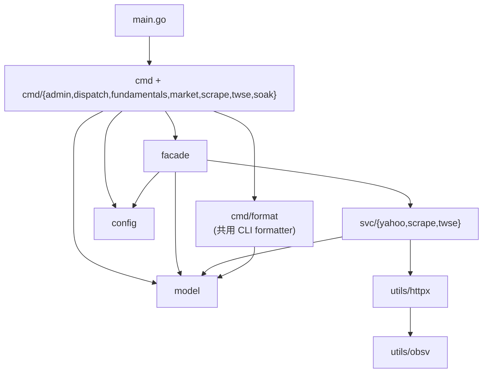

# CLAUDE.md - Technical Context

## 🚀 Commands

### Build & Run

- **Build CLI**: `make build` or `go build -o yfin .`
- **Install CLI**: `go install .`
- **Run CLI**: `./yfin --help` or `go run .`

### Test & Lint

- **Unit Tests**: `make test` or `go test ./...`
- **Integration Tests**: `go test -tags=integration ./...`
- **Coverage**: `make test-coverage`
- **Lint**: `make lint` or `golangci-lint run`
- **Format**: `make fmt` or `go fmt ./...`

---

## 🗂️ Project Structure

Module path: `github.com/bizshuk/yfin` (曾用名 `yfinance-go`).

### 依賴圖 (Dependency Graph)

依賴方向嚴格由上往下，無環 (DAG)。`model/` 與 `config/` 是 leaf。

| 層 (Layer)          | 套件 (Packages)                                | 可依賴 (May import)         |
| ------------------- | ---------------------------------------------- | --------------------------- |
| leaf                | `model`, `config`, `utils/obsv`, `utils/cache` | 無 (nothing internal)       |
| infra               | `utils/httpx`                                  | `utils/obsv`                |
| service             | `svc/{yahoo,scrape,twse}`                      | `model`, `utils/httpx`      |
| facade              | `facade`                                       | `svc/*`, `model`, `config`  |
| cmd                 | `cmd`, `cmd/*`                                 | `facade`, `model`, `config` |
| cmd (formatter leaf)| `cmd/format`                                   | `model` only                |

> `cmd/*` 對 `svc/*` 的 import 邊數為 `0`；以 `go list -f '{{.ImportPath}} {{join .Imports " "}}' ./cmd/... | grep svc/` 驗證，應無輸出。

### 套件職責 (Package Responsibilities)

- `facade/`: Publicly exported, reflection-free plain Go structs (e.g. `facade.Bar`, `facade.Quote`) for external packages (e.g., `stock`, `data`) to avoid importing `svc/*` internals. Two constructors: `facade.NewClient()` / `facade.NewClientWithConfig(*httpx.Config)`. The `*Client` is the **single handler** for both external SDK consumers AND the in-repo `yfin` CLI — all data fetching routes through it. `facade.*` DTOs are **type aliases** for `model.*` — a back-compat shim only. `Client` 的方法依 surface 分檔，一檔一職責：
    - `client.go`: `Client` struct (MIC cache + `sync.RWMutex`) + 2 constructors + 共用 helper (`inferMICForSymbol` / `isAuthenticationError`)。
    - `client_yahoo.go`: 8 個 chart-API `Fetch*`（Daily/Intraday/Weekly/Monthly bars、Quote、FundamentalsQuarterly、CompanyInfo、MarketData），回傳 float64 的 plain SDK struct。
    - `client_norm.go`: 4 個 `Fetch*Norm` 變體，回傳 `*model.Normalized*`（保留 ScaledDecimal 精度）。
    - `client_scrape.go`: 8 個 `Scrape*`，走 `svc/scrape` 抓頁面後直接轉 model。
    - `twse.go` / `twse_dispatch.go`: `TwseClient` 不透明 handle（含建構、`Dispatch`、no-data 判定）/ endpoint registry + 23 個 fetcher map。
- `svc/`: SDK-first business services (HTTP fetch + decode + validation only):
    - `svc/yahoo/`: Yahoo Finance raw HTTP API client (Crumb auth, chart API, fundamentals). Owns its response envelope types (BarsResponse, QuoteResponse, FundamentalsResponse, etc.); these stay in svc/yahoo because model/normalize.go consumes them and Go would create an import cycle if they moved to model/.
    - `svc/scrape/`: Web scraping engine (robots.txt compliant, fills API gaps). Owns HTTP/parse logic + scrape-config types (`Config`/`RetryConfig`/`EndpointConfig`/`RobotsPolicy`/`RegexConfig`); DTOs (ComprehensiveFinancialsDTO, KeyStatisticsDTO, etc.) are now re-exported as `model.*` aliases for cross-layer reuse. News 抽取依職責分 5 檔：`extract_news.go`（`ParseNews` 編排 + HTML-regex 策略）、`extract_news_json.go`（內嵌 tickerStream JSON 策略，優先路徑）、`news_normalize.go`（URL/相對時間/ticker 正規化 + 去重）、`news_regex_config.go`（YAML-driven regex pattern 設定）、`news_metrics.go`（Prometheus 指標）。
    - `svc/twse/`: Taiwan Stock Exchange open data client + parsers (23 endpoints). Owns HTTP/fetch logic + `Registry`/`Dispatcher`/`Fetcher`/`Endpoint` meta; the 23 `*Response` envelope structs and `*Row` typed rows are re-exported as `model.*` aliases for cross-layer reuse.
- `model/`: Pure data types + normalization logic — the **lowest layer** of the dependency graph. Houses: 8 facade-aligned SDK DTOs (`Bar`/`BarBatch`/`Quote`/`MarketData`/`CompanyInfo`/`FundamentalsSnapshot`/`FundamentalsLine`/`NewsItem`), `ScaledDecimal` precision type + helpers, `Security` + `InferMIC` + `CreateSecurity` + `ExchangeToMIC`, 9 `Normalized*` types + 4 `Converted*` + `ConvertTo` methods + `FXConverter`/`FXMeta`/`MockFXConverter`, all `Normalize*` functions (`NormalizeBars`/`Quote`/`Fundamentals`/`MarketData`/`CompanyInfo`/`Holders`/`Insider`), `ToUTCDayBoundaries`, scrape DTOs (`FetchMeta`/`ScrapeNewsItem`/`NewsStats`/value types/`Scaled` alias/`Currency` alias/`YahooNum`/`YahooInt`/`YahooString`/all comprehensive DTOs), TWSE `Response` envelope + 22 endpoint `*Response` + `*Row` types, and `scrape_convert.go` (DTO→model direct converters: `ScrapeFinancialsToSnapshot`/`BalanceSheet`/`CashFlow`/`KeyStatistics`/`Analysis`/`AnalystInsights` + `ScrapeNewsToItems`, replacing the former ampy-proto emit hop). **`svc/norm/` was merged into `model/`** in Phase 2; `svc/norm/` no longer exists.
- `utils/`: Shared infrastructure (`utils/*` may NOT import `svc/*`):
    - `utils/httpx/`: Resilient HTTP client — QPS rate limiting, exponential backoff, retry logic, circuit breaker. Single shared `http.Client`; session rotation removed.
    - `utils/cache/`: Refresh-frequency cache (daily/monthly/quarterly).
    - `utils/obsv/`: Structured logging (stdlib `slog`) + OpenTelemetry tracing (no-op tracer) + Prometheus metrics. Stands alone on stdlib + OTel + `prometheus/client_golang` (no external observability wrapper).
- `config/`: Top-level YAML loader (`os.ReadFile` + `yaml.Unmarshal` into `map[string]interface{}`, then env-var interpolation + struct mapping + validation) — `config.Config` / `config.NewLoader` / `config.CreateEffectiveConfig`。一個 config section 一個檔案（`http.go` / `scrape.go` / `fx.go` / `markets.go` / `retry.go` ...），`loader.go` 只管讀檔與插值，`adapters.go` 只管轉成 HTTP/scrape/FX 的下游型別。leaf 套件，不 import 任何內部套件。runtime 預設設定 `effective.yaml` 同目錄併存（不同環境以 `app.env` 區分）。
- `cmd/`: CLI composition root. `main.go` calls each sub-package's `Register(RootCmd)`:
    - `cmd/{root,client,global,build,exitcodes}.go`: helpers + persistent flags + shared client builder (`CreateClient()` returns `*facade.Client`).
    - `cmd/admin/`: `config-effective`, `version`.
    - `cmd/dispatch/`: `batch` (sub-package name is `dispatch` but no top-level `yfin dispatch` command exists).
    - `cmd/format/`: **共用** 的 comprehensive-\* DTO → stdout formatter（`ComprehensiveStatistics` / `ComprehensiveProfile` / `ComprehensiveFinancials`），一個 DTO 一個檔案。`cmd/fundamentals` 與 `cmd/scrape` 都由此取用；此套件只 import `model/`，是 leaf。
    - `cmd/fundamentals/`: `fundamentals`, `comprehensive-stats`, `comprehensive-profile`.
    - `cmd/market/`: `pull`, `quote`.
    - `cmd/scrape/`: `scrape` (4 mutually-exclusive modes: `--check` / `--preview` / `--preview-json` / `--preview-news`；`--preview-proto` 已隨 ampy-proto 移除)。
    - `cmd/twse/`: `twse` (23 endpoints with `--endpoint` / `--date` / `--stock` / `--month` flags). 只 import `facade`；TWSE client 是 `*facade.TwseClient` 不透明 handle，dispatch 走 `client.Dispatch(ctx, endpoint, date, opts)`。
    - `cmd/soak/`: Standalone binary `soak` (invoked via `go run ./cmd/soak`, NOT `yfin soak`).
    - `cmd/samples/`, `cmd/tools/`: scripts + golden fixtures.

> CLI tree is **flat** (`yfin pull`, `yfin quote`, ...) — there are no nested groups. `cmd/market/` is the Go sub-package directory name, not a user-facing group.
>
> **Architecture contract: `cmd → facade → svc → model`** (model is the lowest layer; svc depends on model; facade depends on svc + model; cmd depends on facade + model). The yfin CLI's runtime code never calls `svc/*` directly — every fetch goes through `cmd.CreateClient()` (returns `*facade.Client`) which wraps `facade.NewClientWithConfig()`. The CLI flag overrides (`--qps` / `--retry-max` / `--timeout`) are applied in `cmd.CreateClient()` on top of the YAML HTTP settings. Cmd sub-packages (`market` / `fundamentals` / `scrape` / `dispatch` / `twse`) only interact with `svc/yahoo` / `svc/scrape` / `svc/twse` through facade's plain-SDK methods or facade-level wrappers (`(*facade.Client).ScrapeFetch` / `(*facade.TwseClient).Dispatch` / `facade.YahooDispatch` etc.). `model/*` imports in cmd ARE allowed (DTOs as formatter parameters). Scrape DTOs convert to model directly via `model.Scrape*ToSnapshot` / `model.ScrapeNewsToItems` (in `model/scrape_convert.go`) — there is no ampy-proto emit hop. External packages (stock, data) call `facade.NewClient()` directly or import `model/` for raw types.
>
> **facade 不得在簽名上洩漏 `svc/*` 的具體型別。** 若 facade 回傳裸的 `*svc/twse.Client`，cmd 光是為了宣告變數就被迫 import `svc/twse`，契約當場破功（此事發生過）。跨越 facade 邊界的 handle 一律包成 facade 自有的不透明型別（如 `facade.TwseClient`），並把操作掛成它的 method。純資料的 re-export（`type TwseEndpoint = twse.Endpoint`、`var TwseRegistry`）可以，因為 alias 讓 cmd 不必 import svc 就能指名該型別。

> **Why yahoo raw shapes are now in `model/`** — yahoo raw-shape structs (`ChartBar`/`RawQuote`/`ChartMeta`/`Fundamentals`/`IncomeStatement`/etc.) live in `model/yahoo_raw.go`. svc/yahoo imports `model/` (one-way only), decoders return `*model.ChartResponse`/`*model.QuoteResponse`/`*model.FundamentalsResponse` directly, and `yahoo.X` aliases in `svc/yahoo/*.go` keep callers compiling unchanged. There is no cycle because `model/` does not import `svc/yahoo`.

---

## 🔧 Code Conventions & Decisions

1. **No Session Rotation**: Session rotation was removed to simplify HTTP connection reuse and state management. The HTTP client relies on a single shared `http.Client` with robust rate-limiting, retries, and circuit breakers. `--sessions` persistent flag remains for backward compatibility but its effect is vestigial.
2. **Facade boundary (legacy)**: External projects (stock, data, ...) may import from `facade/` for the legacy back-compat surface OR from `model/` directly for raw types. The recommended path is `model/` since `facade/` types are now just aliases. **Avoid `ScaledDecimal` in external surfaces** — use float64 via `model.Bar`/`model.Quote`/etc.
3. **Decimals**: Prices/amounts are internally stored as `ScaledDecimal` for precision in `model.Normalized*` types. External-facing `model.Bar`/`model.Quote`/etc. expose float64. Conversion between the two is `model.FromScaledDecimal(sd)`.
4. **Timezones**: All timestamps must be handled in UTC. `model.ToUTCDayBoundaries()` is the canonical epoch→day conversion.
5. **`cmd → facade → svc → model` strict path**: The yfin CLI's runtime code (`cmd/**/*.go`) MUST NOT call any `svc/*` package directly. All data fetching goes through `cmd.CreateClient() → *facade.Client`; all dispatch (YahooDispatch / ScrapeFetch / `(*TwseClient).Dispatch` / Parse*) goes through `facade/`. `model/*` imports in cmd ARE allowed (DTOs as formatter parameters; scrape DTO→model conversion lives in `model/scrape_convert.go`). New code in `cmd/` that needs a `svc/*` capability should expose a facade wrapper first rather than importing `svc/*`. 驗證指令：`go list -f '{{.ImportPath}} {{join .Imports " "}}' ./cmd/... | grep svc/` 必須無輸出。
6. **model/ lowest-layer rule**: `model/` does NOT import `svc/*`, `facade/`, or `cmd/`. All raw-shape structs consumed by `Normalize*` (ChartBar, RawQuote, ChartMeta, Fundamentals, IncomeStatement, etc.) live in `model/yahoo_raw.go`. svc/yahoo decoders return `*model.ChartResponse`/`*model.QuoteResponse`/`*model.FundamentalsResponse` directly, so the cycle is broken.
7. **External SDK objects decode at upper layer**: When integrating a third-party SDK whose data shapes don't naturally fit `model/`, the decode/translate step happens in `facade/` (or a dedicated handler), NOT in `model/`. `model/` only owns shapes that result from such decode. The rationale: `model/` should stay import-cycle-free at the bottom of the stack; pushing decode upstream keeps the layer rule simple.
8. **一檔一職責 (one file, one responsibility)**: 一個檔案只回答一個問題。判準不是行數，是「這檔在做幾件事」——`model/twse.go`(412 行、45 個 type) 是單一型別目錄，合格；而 744 行的舊 `extract_news.go` 同時管 regex 設定、Prometheus 指標、HTML 解析、JSON 解析與去重，就該拆。設定載入、觀測性接線、解析策略、值正規化屬於**不同**職責，不得混在同一檔。大型 `Client` 的方法依 surface 分檔（見 `facade/client_*.go`）。
9. **禁止跨套件複製貼上 (no copy-paste across packages)**: 兩個 `cmd/*` 子套件需要同一段邏輯時，把它下沉成共用 leaf 套件（如 `cmd/format/`），不要為了「避免 cross-package dependency」而複製。複製過的程式碼一定會 drift——`cmd/scrape` 與 `cmd/fundamentals` 的 formatter 曾有 264 行逐字重複並已開始分歧。

### Exit Codes (cmd/exitcodes.go)

`0=Success, 1=GeneralError, 2=PaidFeatureRequired, 3=ConfigError`.

### Persistent Flags (cmd/global.go)

`--config`, `--log-level`, `--run-id`, `--concurrency`, `--qps`, `--retry-max`, `--sessions` (vestigial), `--timeout`, `--observability-disable-tracing`, `--observability-disable-metrics`.

### Dependencies

| Dep                                                | ver         |
| -------------------------------------------------- | ----------- |
| `github.com/bizshuk/yfin` (module)                 | `go 1.26.0` |
| `github.com/bizshuk/gosdk`                         | `v1.1.0`    |
