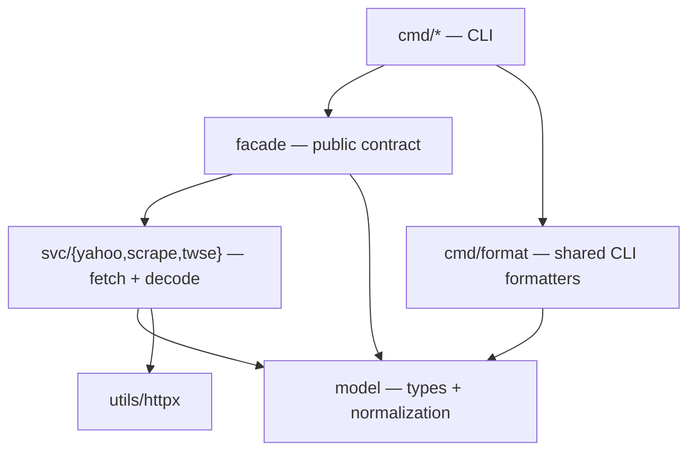

# yfin — Yahoo Finance Client for Go

[](https://golang.org/)
[](LICENSE)
[](https://goreportcard.com/report/github.com/bizshuk/yfin)
[](https://godoc.org/github.com/bizshuk/yfin)

> ⚠️ **IMPORTANT DISCLAIMER** ⚠️
>
> **This project is NOT affiliated with, endorsed by, or sponsored by Yahoo Finance or Yahoo Inc.**
>
> This is an **independent, open-source Go client** that accesses publicly available financial data from Yahoo Finance's website. Yahoo Finance does not provide an official API for this data, and this client operates by scraping publicly accessible web pages.
>
> **Use at your own risk.** Yahoo Finance may change their website structure at any time, which could break this client. We make no guarantees about data accuracy, availability, or compliance with Yahoo Finance's terms of service.
>
> **Legal Notice:** Users are responsible for ensuring their use of this software complies with Yahoo Finance's terms of service and applicable laws in their jurisdiction.

---

## 🎯 Problem We're Solving

**The Challenge:** Most financial data clients suffer from inconsistent data formats, unreliable APIs, and poor error handling. When building financial applications, developers often face:

- **Inconsistent Data Formats**: Different APIs return data in various shapes and formats
- **Floating Point Precision Issues**: Financial calculations require exact decimal precision
- **Rate Limiting Problems**: Unbounded requests lead to API bans and throttling
- **Poor Error Handling**: Limited retry logic and circuit breaking
- **Currency Conversion Complexity**: Multi-currency support is often missing or buggy
- **No Standardization**: Each client has its own data structures and conventions

**Our Solution:** A production-grade Go client that provides:

✅ **Standardized Data Formats** - One canonical `model.*` shape per concept, whatever the source (API or scrape)  
✅ **High Precision Decimals** - Scaled decimal arithmetic for financial accuracy  
✅ **Robust Rate Limiting** - Built-in backoff, circuit breakers, and QPS rate limiting  
✅ **Multi-Currency Support** - Automatic currency conversion with FX providers  
✅ **Production Ready** - Comprehensive error handling, observability, and monitoring  
✅ **Easy Integration** - Simple API with both library and CLI interfaces

---

## 🚀 Installation

### As a Go Module

```bash
go get github.com/bizshuk/yfin
```

### From Source

`package main` lives at the repo root — there is no `cmd/yfin` directory.

```bash
git clone https://github.com/bizshuk/yfin.git
cd yfin
make build          # or: go build -o yfin .
```

---

## 🧱 Architecture

Dependencies point strictly downward — the graph is a DAG, and `model/` sits at the bottom importing nothing internal.



The contract is `cmd → facade → svc → model`. The CLI never reaches into `svc/*`; every fetch goes through `facade.Client`, which is the same handle external consumers use. That means anything the CLI can do, your code can do — there is no privileged internal path.

Downstream packages should import `facade/` (convenience, `float64` prices) or `model/` (raw types, `ScaledDecimal` precision). Never `svc/*`.

---

## 📖 Quick Start

### Basic Usage

```go
package main

import (
    "context"
    "fmt"
    "log"
    "time"

    "github.com/bizshuk/yfin/facade"
)

func main() {
    // Create a new client (uses default HTTP config).
    client := facade.NewClient()
    ctx := context.Background()

    // Fetch daily bars for Apple
    start := time.Date(2024, 1, 1, 0, 0, 0, 0, time.UTC)
    end := time.Date(2024, 1, 31, 0, 0, 0, 0, time.UTC)

    // facade returns plain structs with float64 prices — no ScaledDecimal math.
    batch, err := client.FetchDailyBars(ctx, "AAPL", start, end, true, "my-run-id")
    if err != nil {
        log.Fatal(err)
    }

    fmt.Printf("Fetched %d bars for %s\n", len(batch.Bars), batch.Symbol)
    for _, bar := range batch.Bars {
        fmt.Printf("Date: %s, Close: %.4f %s\n",
            bar.Date, bar.Close, bar.CurrencyCode)
    }
}
```

---

## 🔧 API Reference

### Client Creation

```go
// Default client with standard configuration
client := facade.NewClient()

// Custom HTTP config (QPS, retries, timeout, circuit breaker)
client := facade.NewClientWithConfig(&httpx.Config{ /* ... */ })
```

### Available Functions

#### 📊 Historical Data

**FetchDailyBars** - Get daily OHLCV data

```go
bars, err := client.FetchDailyBars(ctx, "AAPL", start, end, adjusted, runID)
```

**FetchIntradayBars** - Get intraday data (1m, 5m, 15m, 30m, 60m)

```go
bars, err := client.FetchIntradayBars(ctx, "AAPL", start, end, "1m", runID)
```

> **Note:** Intraday data may not be available for all symbols and may return HTTP 422 errors for some requests.

**FetchWeeklyBars** - Get weekly OHLCV data

```go
bars, err := client.FetchWeeklyBars(ctx, "AAPL", start, end, adjusted, runID)
```

**FetchMonthlyBars** - Get monthly OHLCV data

```go
bars, err := client.FetchMonthlyBars(ctx, "AAPL", start, end, adjusted, runID)
```

#### 💰 Real-time Data

**FetchQuote** - Get current market quote

```go
quote, err := client.FetchQuote(ctx, "AAPL", runID)
```

**FetchMarketData** - Get comprehensive market data

```go
marketData, err := client.FetchMarketData(ctx, "AAPL", runID)
```

#### 🏢 Company Information

**FetchCompanyInfo** - Get basic company information

```go
companyInfo, err := client.FetchCompanyInfo(ctx, "AAPL", runID)
```

**FetchFundamentalsQuarterly** - Get quarterly financials (requires paid subscription)

```go
fundamentals, err := client.FetchFundamentalsQuarterly(ctx, "AAPL", runID)
```

---

## 🗂️ Facade Layer (Reflection-free Plain Go Structs)

The `facade` package exposes normalized Yahoo Finance models (bars, quotes, company info, market data, fundamentals, news) as plain Go structs that use `float64` for prices and standard `time.Time` for timestamps, instead of the internal `ScaledDecimal` representations. External consumers should use `facade.Client` directly — no manual conversion is needed.

`facade.Client` is the **public contract** for downstream packages (`stock`, `data`, ...). It is the same handle that the CLI uses internally via `cmd.CreateClient()`.

### Usage Example

```go
package main

import (
    "context"
    "fmt"
    "log"
    "time"

    "github.com/bizshuk/yfin/facade"
)

func main() {
    client := facade.NewClient()
    ctx := context.Background()

    // facade.Client returns plain structs directly — no ScaledDecimal math.
    batch, err := client.FetchDailyBars(ctx, "AAPL",
        time.Now().AddDate(0, 0, -5), time.Now(), true, "run-id")
    if err != nil {
        log.Fatal(err)
    }

    fmt.Printf("Symbol: %s (MIC=%s)\n", batch.Symbol, batch.MIC)
    for _, bar := range batch.Bars {
        // Close is a float64 directly
        fmt.Printf("Date: %s, Close: %.2f %s\n",
            bar.Date, bar.Close, bar.CurrencyCode)
    }
}
```

### Available Public Types

- `*facade.BarBatch` — `{Symbol, MIC, []Bar}`; each `Bar` has `Date` (UTC `YYYY-MM-DD`), `Open/High/Low/Close` as `float64`, `Volume int64`, `Adjusted bool`, `CurrencyCode string`.
- `*facade.Quote` — `{Symbol, Price float64, Currency, EventTime time.Time}`.
- `*facade.CompanyInfo` — string pass-through of Security metadata (`Symbol`, `LongName`, `Exchange`, `Currency`, `Timezone`, ...).
- `*facade.MarketData` — nullable `*float64` price fields + `*int64` volume; `nil` = missing (not zero).
- `*facade.FundamentalsSnapshot` — quarterly fundamentals (paid subscription required).
- `[]facade.NewsItem` — `{Title, URL, Source, Summary, PublishedAt, Symbols}`.

The raw `FromBarBatch` / `FromQuote` / `FromCompanyInfo` converters are also exported for callers that already hold a `*model.Normalized*` value, but new code should prefer the `facade.Client` methods, which return the plain structs directly.

Need `ScaledDecimal` precision instead of `float64`? Use the `Norm` variants — `FetchDailyBarsNorm` / `FetchQuoteNorm` / `FetchFundamentalsNorm` / `FetchMarketDataNorm` — which stop at the normalization step and hand back the `*model.Normalized*` types.

---

## 🕸️ Scrape Fallback System

When Yahoo Finance API endpoints are unavailable, rate-limited, or require paid subscriptions, yfin automatically falls back to web scraping with full data consistency guarantees.

### Key Features

- **Automatic Fallback**: Seamlessly switches between API and scraping
- **Data Consistency**: Identical output formats regardless of source
- **Production Safety**: Respects robots.txt, implements proper rate limiting
- **Comprehensive Coverage**: Access data not available through APIs

### Supported Scrape Endpoints

- **Key Statistics**: P/E ratios, market cap, financial metrics
- **Financials**: Income statements, balance sheets, cash flow
- **Analysis**: Comprehensive analyst data including:
    - Earnings estimates (current/next quarter, current/next year)
    - EPS trends (current estimate, 7/30/60/90 days ago)
    - EPS revisions (up/down revisions in last 7/30 days)
    - Revenue estimates (quarterly and annual)
    - Growth estimates
- **Analyst Insights**: Target prices, recommendations, analyst counts
- **Profile**: Company information, executives, business summary
- **News**: Recent news articles and press releases

### Quick Scrape Examples

```go
// Scrape key statistics (not available through free API)
keyStats, err := client.ScrapeKeyStatistics(ctx, "AAPL", runID)

// Scrape financial statements
financials, err := client.ScrapeFinancials(ctx, "AAPL", runID)

// Scrape comprehensive analysis data (earnings trends, EPS revisions, revenue estimates)
analysis, err := client.ScrapeAnalysis(ctx, "AAPL", runID)

// Scrape analyst insights (target prices, recommendations)
analystInsights, err := client.ScrapeAnalystInsights(ctx, "AAPL", runID)

// Scrape news articles
news, err := client.ScrapeNews(ctx, "AAPL", runID)
```

### CLI Scraping

```bash
# Scrape key statistics with preview
yfin scrape --ticker AAPL --endpoint key-statistics --preview

# Multiple endpoints with JSON output
yfin scrape --ticker AAPL --endpoints key-statistics,financials,news --preview-json

# Soak testing is a separate binary, not a yfin subcommand
go run ./cmd/soak --universe-file universe.txt --duration 2h --qps 5
```

📖 **[Complete Scrape Documentation →](docs/scrape/overview.md)**

---

## 📝 Usage Examples

### Example 1: Fetch Daily Bars for Multiple Symbols

```go
package main

import (
    "context"
    "fmt"
    "log"
    "sync"
    "time"

    "github.com/bizshuk/yfin/facade"
)

func main() {
    client := facade.NewClient()
    ctx := context.Background()

    symbols := []string{"AAPL", "GOOGL", "MSFT", "TSLA"}
    start := time.Date(2024, 1, 1, 0, 0, 0, 0, time.UTC)
    end := time.Date(2024, 1, 31, 0, 0, 0, 0, time.UTC)

    var wg sync.WaitGroup
    results := make(chan string, len(symbols))

    for _, symbol := range symbols {
        wg.Add(1)
        go func(sym string) {
            defer wg.Done()

            batch, err := client.FetchDailyBars(ctx, sym, start, end, true, "batch-run")
            if err != nil {
                results <- fmt.Sprintf("Error fetching %s: %v", sym, err)
                return
            }

            results <- fmt.Sprintf("%s: %d bars fetched", sym, len(batch.Bars))
        }(symbol)
    }

    wg.Wait()
    close(results)

    for result := range results {
        fmt.Println(result)
    }
}
```

### Example 2: Get Current Market Quote

```go
package main

import (
    "context"
    "fmt"
    "log"

    "github.com/bizshuk/yfin/facade"
)

func main() {
    client := facade.NewClient()
    ctx := context.Background()

    quote, err := client.FetchQuote(ctx, "AAPL", "quote-run")
    if err != nil {
        log.Fatal(err)
    }

    fmt.Printf("Symbol: %s\n", quote.Symbol)
    fmt.Printf("Price: %.4f %s\n", quote.Price, quote.Currency)
    fmt.Printf("Event Time: %s\n", quote.EventTime.UTC().Format("2006-01-02 15:04:05"))
}
```

### Example 3: Fetch Company Information

```go
package main

import (
    "context"
    "fmt"
    "log"

    "github.com/bizshuk/yfin/facade"
)

func main() {
    client := facade.NewClient()
    ctx := context.Background()

    info, err := client.FetchCompanyInfo(ctx, "AAPL", "company-run")
    if err != nil {
        log.Fatal(err)
    }

    fmt.Printf("Company: %s\n", info.LongName)
    fmt.Printf("Exchange: %s\n", info.Exchange)
    fmt.Printf("Full Exchange: %s\n", info.FullExchangeName)
    fmt.Printf("Currency: %s\n", info.Currency)
    fmt.Printf("Instrument Type: %s\n", info.InstrumentType)
    fmt.Printf("Timezone: %s\n", info.Timezone)
}
```

### Example 4: Error Handling

```go
package main

import (
    "context"
    "fmt"
    "log"
    "time"

    "github.com/bizshuk/yfin/facade"
)

func main() {
    client := facade.NewClient()
    ctx := context.Background()

    // Fetch data with proper error handling
    batch, err := client.FetchDailyBars(ctx, "AAPL",
        time.Date(2024, 1, 1, 0, 0, 0, 0, time.UTC),
        time.Date(2024, 1, 31, 0, 0, 0, 0, time.UTC),
        true, "error-handling-run")

    if err != nil {
        log.Printf("Error fetching bars: %v", err)
        return
    }

    fmt.Printf("Successfully fetched %d bars\n", len(batch.Bars))

    // Handle empty results
    if len(batch.Bars) == 0 {
        fmt.Println("No data available for the specified date range")
        return
    }

    // Process the data — Bar.Close is a plain float64
    for _, bar := range batch.Bars {
        fmt.Printf("Date: %s, Close: %.4f %s\n",
            bar.Date, bar.Close, bar.CurrencyCode)
    }
}
```

## 🐍→🦫 Batch Mode (Python yf parity)

`yfin batch` 對等複刻 `skills/scripts/all_ticker_yf.py`,以 Go 重做整套批次抓取 + 分級快取管線:

- 30 個資料維度(含 quoteSummary 新增的 holders / insider / upgrades / calendar / sec-filings / sustainability / isin / options / actions / metadata)對齊 Python 的 30 指令。
- 認證:Yahoo 免費 cookie + crumb,無需付費訂閱即可走 `v10/finance/quoteSummary` 與 `v7/finance/options/`。
- 輸出結構一致:`<rawDir>/<command>/<ticker>.<YYYY-MM-DD>.json`;失敗寫 `<rawDir>/_failed/<ticker>.<command>.err`。
- 快取分級沿用 Python 的 `REFRESH_MAP`(`daily` / `monthly` / `quarterly` / `annually`)。

```bash
# 預設:抓 skills/references/ticker_list.csv 中所有 ticker × 30 指令
./yfin batch

# 單股 / 強制重抓 / 調整並行
./yfin batch --ticker 2330.TW
./yfin batch --ticker 2330.TW --force
./yfin batch --max-workers 5
```

對應 Python 端:在 `skills/SKILL.md` 末尾的 `## Go client 對等能力 (Go parity)` 段。

### Cross-Verify Parity Matrix(30 指令)

`★ Insight ─────────────────────────────────────`
經過逐一對照 yfinance source 與 `cmd/dispatch/dispatch.go` 的 `commandRegistry`,目前 30 個指令**全部達到 Python 語意對等**(`earnings-dates` 走 HTML scrape、`metadata` 1d range 對齊 `get_history_metadata` 的不重抓語意,均已對應)。
`─────────────────────────────────────────────────`

| 指令                                                                                                     | 來源 (Python)                                     | Go 端實作                                | 對齊 |
| -------------------------------------------------------------------------------------------------------- | ------------------------------------------------- | ---------------------------------------- | ---- |
| info                                                                                                     | 5 quoteSummary 模組                               | `(*yahoo.Client).FetchInfo`              | ✅   |
| history                                                                                                  | chart 30d/daily                                   | `(*facade.Client).FetchDailyBars` 30d    | ✅   |
| actions                                                                                                  | chart events                                      | `(*yahoo.Client).FetchActions`           | ✅   |
| income / balance / cashflow                                                                              | scrape HTML                                       | `ScrapeFinancials/BalanceSheet/CashFlow` | ✅   |
| major-holders / institutional-holders / mutualfund-holders                                               | quoteSummary 7 模組(單次 HTTP)                    | `FetchHolders`(同 4 模組)                | ✅   |
| insider-transactions / insider-roster                                                                    | quoteSummary                                      | `FetchInsider`                           | ✅   |
| insider-purchases                                                                                        | netSharePurchaseActivity 整形為 label/value table | `InsiderPurchaseSummaryTable`            | ✅   |
| recommendations / recommendations-summary                                                                | 同源(quoteSummary)                                | `FetchRecommendationTrend`               | ✅   |
| upgrades                                                                                                 | quoteSummary                                      | `FetchUpgrades`                          | ✅   |
| earnings-dates                                                                                           | **HTML scrape** `/calendar/earnings?symbol=`      | `(*yahoo.Client).FetchEarningsDates`     | ✅   |
| earnings-history / eps-trend / eps-revisions / earnings-estimates / revenue-estimates / growth-estimates | quoteSummary                                      | `ScrapeAnalysis`                         | ✅   |
| price-targets                                                                                            | quoteSummary                                      | `ScrapeAnalystInsights`                  | ✅   |
| news                                                                                                     | scrape HTML/JSON                                  | `ScrapeNews`                             | ✅   |
| calendar                                                                                                 | quoteSummary `calendarEvents`                     | `FetchCalendar`                          | ✅   |
| sec-filings                                                                                              | quoteSummary                                      | `FetchSecFilings`                        | ✅   |
| sustainability                                                                                           | quoteSummary `esgScores`                          | `FetchESG`                               | ✅   |
| isin                                                                                                     | business-insider                                  | `FetchISIN`                              | ✅   |
| options                                                                                                  | `/v7/finance/options/`                            | `FetchOptions`                           | ✅   |
| metadata                                                                                                 | 1d chart(不重抓)                                  | `FetchMetadata`(1d range)                | ✅   |

對應 commit 範圍:`6cc0517` → `4db5d5d`(21 個功能 commit)+ `e769820`/`a580493`/`7e4af80`/`4db5d5d`/`5c35fac`/`d09291c`(6 個 cross-verify fix)。

---

## 📚 Documentation

> **Note:** For the latest release notes, see [Release Notes](docs/history/releases/RELEASE_NOTES.md). For the complete changelog, see [CHANGELOG.md](CHANGELOG.md).

### Core Documentation

- **[Installation Guide](docs/getting-started/install.md)** - Setup and installation instructions
- **[Usage Guide](docs/cli/usage.md)** - Comprehensive usage examples and patterns
- **[API Reference](docs/api/reference.md)** - Complete API documentation with method capabilities and limitations
- **[Data Structures](docs/api/data-structures.md)** - Detailed data structure guide with field naming conventions
- **[Complete Examples](docs/api/examples.md)** - Working code examples with data processing and error handling

### Method Comparison & Migration

- **[Method Comparison](docs/comparisons/method-comparison.md)** - Method comparison table and use case guidance
- **[Migration Guide](docs/integrations/migration-guide.md)** - Migration from Python yfinance with feature comparison

### Error Handling & Quality

- **[Error Handling Guide](docs/operations/error-handling.md)** - Comprehensive error handling and troubleshooting
- **[Data Quality Guide](docs/operations/data-quality.md)** - Data quality expectations and validation guidelines
- **[Performance Guide](docs/operations/performance.md)** - Performance optimization and best practices

### Scrape Fallback System

- **[Scrape Overview](docs/scrape/overview.md)** - Architecture and data flow
- **[Configuration Guide](docs/operations/configuration.md)** - All configuration options and best practices
- **[CLI Usage](docs/scrape/cli.md)** - Command-line interface examples
- **[Troubleshooting](docs/operations/error-handling.md)** - Common issues and solutions

### Operations & Monitoring

- **[Observability Guide](docs/operations/observability.md)** - Metrics, logging, and monitoring
- **[Soak Testing Guide](docs/cli/soak-testing.md)** - Load testing and validation
- **[Production Readiness Report](docs/history/production-readiness.md)** - Production readiness assessment and checklist

### Development & Testing

- **[Testing Implementation](docs/history/testing-implementation.md)** - Testing strategy and implementation details
- **[Release Guide](docs/history/releases/RELEASE_GUIDE.md)** - Release process and procedures
- **[Release Notes](docs/history/releases/RELEASE_NOTES.md)** - Version release notes and changelog

### Audit & Quality Assurance

- **[Final Audit Summary](docs/history/audit/FINAL_AUDIT_SUMMARY.md)** - Production readiness audit & applied fixes (2025-01-30)

### Operator Runbooks

- **[Scrape Fallback Runbook](dashboards/runbooks/scrape-fallback.md)** - Operational procedures
- **[Incident Response Playbook](dashboards/runbooks/incident-playbook.md)** - Emergency response procedures

### Examples & Code Samples

- **[Library Examples](facade/samples/)** - Go code examples and patterns
- **[CLI Examples](cmd/samples/)** - Ready-to-run shell scripts
- **[API Usage Example](facade/samples/api_usage/api_usage.go)** - Basic API usage
- **[Historical Data Example](facade/samples/historical_data/historical_data_example.go)** - Time series data

---

## 🖥️ CLI Usage

The `yfin` CLI tool provides command-line access to all functionality:

> **Note:** All CLI commands require a configuration file. Use `--config config/effective.yaml` or set up your own config file.

### Installation

```bash
# Build from source (package main is at the repo root)
go build -o yfin .

# Or install globally
go install github.com/bizshuk/yfin@latest
```

### Basic Commands

```bash
# Fetch daily bars for a single symbol
yfin pull --ticker AAPL --start 2024-01-01 --end 2024-12-31 --adjusted split_dividend --preview --config config/effective.yaml

# Fetch data for multiple symbols from a file
yfin pull --universe-file symbols.txt --start 2024-01-01 --end 2024-12-31 --out json --out-dir ./out --config config/effective.yaml

# Get current quote
yfin quote --tickers AAPL --config config/effective.yaml

# Get fundamentals (requires paid subscription)
yfin fundamentals --ticker AAPL --preview --config config/effective.yaml
```

### Scraping Commands

```bash
# Scrape key statistics (not available through free API)
yfin scrape --ticker AAPL --endpoint key-statistics --preview --config config/effective.yaml

# Multiple endpoints with JSON preview
yfin scrape --ticker AAPL --endpoints key-statistics,financials,analysis --preview-json --config config/effective.yaml

# News articles preview
yfin scrape --ticker AAPL --endpoint news --preview-news --config config/effective.yaml

# Health check for endpoints
yfin scrape --ticker AAPL --endpoint key-statistics --check --config config/effective.yaml
```

### Soak Testing Commands

`soak` is a **standalone binary**, not a `yfin` subcommand — run it with `go run ./cmd/soak`.

```bash
# Quick smoke test (10 minutes)
go run ./cmd/soak --universe-file tests/testdata/universe/soak.txt --endpoints key-statistics,news --duration 10m --concurrency 8 --qps 5 --config config/effective.yaml

# Full production soak test (2 hours)
go run ./cmd/soak --universe-file tests/testdata/universe/soak.txt --endpoints key-statistics,financials,analysis,profile,news --duration 2h --concurrency 12 --qps 5 --config config/effective.yaml
```

### CLI Options

#### Core Options

- `--ticker` - Single symbol to fetch
- `--universe-file` - File containing list of symbols
- `--start`, `--end` - Date range (UTC)
- `--adjusted` - Adjustment policy (`raw` | `split_only` | `split_dividend`); defaults to `markets.default_adjustment_policy` from the YAML config (CLI flag overrides the YAML default)
- `--out`, `--out-dir` - Local export format (`json`) and output directory
- `--concurrency` - Number of concurrent requests
- `--qps` - Requests per second limit
- `--retry-max`, `--timeout` - HTTP retry attempts and timeout tuning

#### Scraping Options (`yfin scrape`)

- `--endpoint` - Single endpoint to scrape (`profile`, `key-statistics`, `financials`, `balance-sheet`, `cash-flow`, `analysis`, `analyst-insights`, `news`)
- `--endpoints` - Comma-separated list of endpoints, for `--preview-json`
- `--check` - Check connectivity only (no parsing)
- `--preview` - Show preview without parsing
- `--preview-json` - JSON preview across endpoints
- `--preview-news` - Preview news articles
- `--force` - Scrape even when the API is available

#### Soak Testing Options (`go run ./cmd/soak`)

- `--duration` - Test duration (e.g., 2h, 30m)
- `--endpoints` - Endpoints to exercise
- `--fallback` - Fallback strategy
- `--memory-check` - Enable memory leak detection
- `--probe-interval` - Correctness probe interval
- `--failure-rate` - Simulated failure rate for testing

📖 **[Complete CLI Documentation →](docs/scrape/cli.md)**

---

## 🎯 Mission & Success Criteria

**Mission**  
Provide a **reliable, consistent, and fast** Yahoo Finance client in Go with one canonical shape per concept (`model.*`), so ingestion pipelines and research tools see identical data whether it came from the API or from a scraped page.

**Success looks like**

- Library returns **validated `model.*` structs** with correct UTC times, currency semantics, and adjustment flags.
- CLI supports on-demand pulls and batch backfills; ops can **dry‑run** and **preview** with a single command, then export locally as JSON.
- Concurrency and backoff keep **error rates** and **429/503** responses within policy; throughput is tunable and predictable.
- Observability shows latency/throughput, decode failures, and backoff behavior; alerts catch regressions.

---

## 📊 Data Coverage

### ✅ Supported Data Types

- **Historical Bars** - Daily, weekly, monthly, and intraday OHLCV data
- **Real-time Quotes** - Current market prices, bid/ask, volume
- **Company Information** - Basic company details, exchange info, industry/sector
- **Market Data** - 52-week ranges, market state, trading hours
- **Multi-Currency Support** - Automatic currency conversion with FX providers

### ⚠️ Paid on the API — Available via Scraping

These require a paid Yahoo Finance subscription through the API, but the scrape fallback serves them for free via `client.Scrape*`:

- **Financial Statements** - Income statement, balance sheet, cash flow
- **Analyst Recommendations** - Price targets, ratings
- **Key Statistics** - P/E ratios, market cap, financial metrics
- **Company Profiles** - Business summary, executives, sector info
- **News Articles** - Recent news and press releases

### ⚠️ Available via `batch` / `YahooDispatch` only

Reachable through the free cookie+crumb `quoteSummary` path — see the [parity matrix](#cross-verify-parity-matrix30-指令) — but not exposed as first-class `facade.Client.Fetch*` methods. Use `yfin batch --ticker X` or call `facade.YahooDispatch`:

- **Options Data** - Options chains and pricing
- **Insider Trading** - Transactions, roster, purchase summary
- **Institutional Holdings** - Major / institutional / mutual-fund holders
- **Corporate Events** - Calendar, SEC filings, sustainability (ESG), upgrades, ISIN

### ❌ Not Supported

- **Level 2 Market Data** - Order book, bid/ask depth

### 🌍 Supported Markets

- **US Markets** - NYSE, NASDAQ, AMEX
- **International** - Major exchanges worldwide
- **Currencies** - Forex pairs and cryptocurrency
- **Commodities** - Gold, oil, agricultural products
- **Indices** - S&P 500, Dow Jones, NASDAQ Composite

---

## ⚡ Key Features

### 🛡️ Production Ready

- **Rate Limiting** - Built-in QPS limits and burst control
- **Circuit Breakers** - Automatic failure detection and recovery
- **Retry Logic** - Exponential backoff with jitter
- **Scrape Fallback** - Automatic API→scrape fallback with robots.txt compliance
- **Observability** - Comprehensive metrics, logs, and tracing
- **Soak Testing** - Built-in load testing and robustness validation

### 💰 Financial Accuracy

- **High Precision Decimals** - Scaled decimal arithmetic for exact calculations
- **Currency Support** - Multi-currency with automatic conversion
- **Corporate Actions** - Split and dividend adjustments
- **Market Hours** - Proper handling of trading sessions and holidays

### 🚀 Performance

- **Concurrent Requests** - Configurable goroutine pools
- **Connection Pooling** - Efficient HTTP connection reuse
- **Caching** - Built-in response caching for FX rates
- **Batching** - Efficient data batching and chunking

### 🔧 Developer Experience

- **Simple API** - Clean, intuitive Go interface
- **Type Safety** - Strongly typed data structures
- **Error Handling** - Comprehensive error types and messages
- **CLI Tool** - Command-line interface for operations
- **Documentation** - Extensive examples and API docs

---

## 📋 Data Formats & Conventions

1. **Time**: All timestamps **UTC** ISO‑8601. Bars use `start` inclusive, `end` exclusive; `event_time` at bar close.
2. **Precision**: Prices/amounts are **scaled decimals** (`scaled`, `scale`). Volumes are integers.
3. **Currency**: Attach **ISO‑4217** code to monetary fields and fundamentals lines.
4. **Identity**: Use `SecurityId` = `{ symbol, mic?, figi?, isin? }`. If MIC is unknown, prefer primary listing inference; document fallback rules.
5. **Adjustments**: Bars declare `adjusted: true|false` and `adjustment_policy_id: "raw" | "split_only" | "split_dividend"`.
6. **Lineage**: Every message has `meta.run_id`, `meta.source="yfin"`, `meta.producer="<host|pod>"`, `schema_version`.
7. **Batching**: Prefer `BarBatch` for efficiency. Maintain **in‑batch order** by `event_time` ascending.
8. **Compatibility**: Additive evolution only; breaking changes require new major (`bars.v2`, `fundamentals.v2`).

### 💰 Price Formatting

There are two price representations, and which one you get depends on which method you called.

The plain `Fetch*` / `Scrape*` methods return `model.Bar` / `model.Quote` etc., whose price fields are already **`float64`**. No conversion needed — this is what most callers want:

```go
batch, _ := client.FetchDailyBars(ctx, "AAPL", start, end, true, runID)
fmt.Printf("Price: %.4f %s\n", batch.Bars[0].Close, batch.Bars[0].CurrencyCode)
```

The `Fetch*Norm` methods return `model.Normalized*`, which keep prices as **`ScaledDecimal`** (an integer plus an explicit scale) so no precision is lost. Convert with `model.FromScaledDecimal` — never hardcode the divisor:

```go
// ✅ CORRECT — read the scale off the value itself
price := model.FromScaledDecimal(bar.Close)

// ❌ WRONG — the scale is not always 4
// price := float64(bar.Close.Scaled) / 10000
```

**Example:** Yahoo reports `$221.74` → stored as `{Scaled: 22174, Scale: 2}` → `22174 / 10^2 = 221.74`.

---

## ⚙️ Configuration

### Environment Variables

```bash
# Rate limiting
export YFIN_QPS=2.0
export YFIN_BURST=5
export YFIN_CONCURRENCY=32

# Timeouts
export YFIN_TIMEOUT=30s
export YFIN_BACKOFF_BASE=1s
export YFIN_BACKOFF_MAX=10s

# Circuit breaker
export YFIN_CIRCUIT_THRESHOLD=5
export YFIN_CIRCUIT_RESET=30s

# Observability
export YFIN_LOG_LEVEL=info
export YFIN_METRICS_ENABLED=true
```

### Configuration File

```yaml
# config.yaml
yahoo:
    timeout_ms: 30000
    base_url: "https://query1.finance.yahoo.com"

concurrency:
    global_workers: 32
    max_inflight: 64

rate_limit:
    per_host_qps: 2.0
    burst: 5

retry:
    attempts: 3
    backoff_base_ms: 1000
    backoff_max_ms: 10000

circuit_breaker:
    failure_threshold: 5
    reset_timeout_ms: 30000

observability:
    log_level: "info"
    metrics_enabled: true
    tracing_enabled: false
```

---

## 🚀 Quick Start Examples

### Run CLI Examples

```bash
# Make scripts executable
chmod +x cmd/samples/*.sh

# Run AAPL preview examples
./cmd/samples/preview_aapl.sh

# Run soak testing examples
./cmd/samples/soak_smoke.sh

# Run batch processing examples
./cmd/samples/batch_processing.sh
```

### Build Library Examples

```bash
# Build and run library examples
go build -o /tmp/scrape_fallback facade/samples/scrape_fallback/scrape_fallback.go
/tmp/scrape_fallback
```

📖 **[Library Samples →](facade/samples/)** · **[CLI Samples →](cmd/samples/)**

---

## 🤝 Contributing

We welcome contributions! Please see our [Contributing Guide](CONTRIBUTING.md) for details.

### Development Setup

```bash
# Clone the repository
git clone https://github.com/bizshuk/yfin.git
cd yfin

# Install dependencies
go mod download

# Run tests
go test ./...

# Build CLI
go build -o yfin .

# Run integration tests
go test -tags=integration ./...
```

### Code Style

- Follow Go standard formatting (`gofmt`)
- Use meaningful variable and function names
- Add tests for new functionality
- Update documentation for API changes

---

## 📄 License

This project is licensed under the MIT License - see the [LICENSE](LICENSE) file for details.

---

## 🙏 Acknowledgments

- **Yahoo Finance** for providing publicly accessible financial data
- **Go Community** for excellent libraries and tools
- **Contributors** who help improve this project

---

## 📞 Support

- **Issues**: [GitHub Issues](https://github.com/bizshuk/yfin/issues)
- **Discussions**: [GitHub Discussions](https://github.com/bizshuk/yfin/discussions)
- **Documentation**: [Complete Documentation](docs/)
- **API Reference**: [GoDoc](https://godoc.org/github.com/bizshuk/yfin)

### Getting Help

1. **Check Documentation**: Start with [docs/](docs/) for comprehensive guides
2. **Review Examples**: See [facade/samples/](facade/samples/) and [cmd/samples/](cmd/samples/) for code samples
3. **Search Issues**: Check existing [GitHub Issues](https://github.com/bizshuk/yfin/issues)
4. **Troubleshooting**: See [docs/scrape/troubleshooting.md](docs/operations/error-handling.md)
5. **Runbooks**: For operational issues, see [dashboards/runbooks/](dashboards/runbooks/)

---

**⭐ If you find this project useful, please give it a star on GitHub!**
