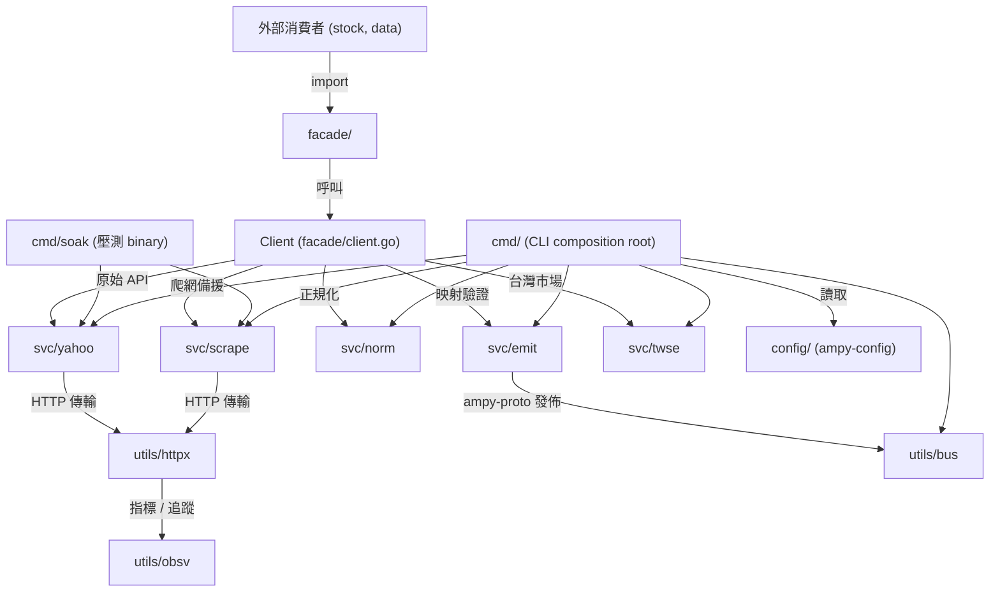

# yfin 架構與套件指南 (Architecture and Packages Guide)

本教學文件將逐一介紹 `yfin` 專案中的所有套件 (package)。本專案採用模組化設計，將職責清晰劃分，確保系統的強健性 (robustness)、可觀測性 (observability) 與高精度的資料正規化。

---

## 系統架構關聯圖

以下為專案中各套件的依賴與呼叫關係圖：

---

## 1. `facade` (對外契約層)

### 職責說明

`facade` 是專案對外的唯一契約邊界 (public contract boundary)，暴露反射免除 (reflection-free) 的純 Go 結構 (plain Go structs)，供外部專案（`stock`、`data` 等）直接 import 使用。

### 關鍵檔案

- `client.go`: 公開的 `Client` 結構與建構子 `NewClient` / `NewClientWithConfig`，實作核心 fetch 方法與備援 (fallback) 機制。
- `bars.go`: 轉換並包裝 K 線 (bar) 資料；定義 `Bar` 與 `BarBatch`。
- `quote.go`: 轉換並包裝即時報價 (quote) 資料。
- `company_info.go`: 轉換並包裝公司基本資訊 (company info)。
- `fundamentals.go`: 定義 `FundamentalsLine` 與 `FundamentalsSnapshot`。
- `market_data.go`: 定義市場資料聚合型別。
- `news.go`: 定義 `NewsItem`。
- `samples/`: 可執行的最小範例（`go run ./facade/samples/...`）。

### 套件設計與運作

- 外部套件在匯入本專案時，應以此套件作為邊界，避免直接存取 `svc/` 或 `utils/`。
- 將內部的定點十進位 `ScaledDecimal` 轉化為標準的 `float64` 浮點數，便於資料序列化 (serialization) 與一般數值計算。
- 整合了 `svc/yahoo` 的原始 API 呼叫與 `svc/scrape` 的爬蟲備援引擎；當付費 API 限制、網路逾時或回傳 `429` 時，能自動切換至爬網流程。
- 所有取回的資料會經由 `svc/norm` 正規化後，以統一格式回傳給呼叫端。

---

## 2. `svc/yahoo` (Yahoo 原始 API 服務)

### 職責說明

`svc/yahoo` 負責與 Yahoo Finance 原始 HTTP API 介面進行通訊，回傳未加工過的原始結構給上層處理。

### 關鍵檔案

- `client.go`: 對接原始 API（如 `/v10/finance/quoteSummary`、`/v7/finance/options`、`/v8/finance/chart`）。
- `auth.go`: 管理 Yahoo API 認證所需的 `Cookie` 與 `Crumb` 機制，會自動刷新並快取。
- `bars.go`, `quotes.go`, `fundamentals.go`: 對接並解析對應的 API 報文 (raw responses)。

### 套件設計與運作

- 由於 Yahoo Finance 頻繁變更 Crumb 授權機制，此套件負責實作 Crumb 的抓取與快取重試邏輯。
- 利用 `utils/httpx` 提供連線，以取得最原始的、未加工過的 Yahoo 資料結構。

---

## 3. `svc/scrape` (網頁爬蟲服務)

### 職責說明

`svc/scrape` 是 HTML 爬網引擎 (scraping engine)，用於在 API 故障或需存取付費欄位時的替代解決方案。

### 關鍵檔案

- `client.go`: 網頁抓取的核心控制流程。
- `robots.go`: 解析與嚴格遵守遠端網站 `robots.txt` 爬蟲協定的模組。
- `financials.go`, `analysis.go`, `statistics.go`: 解析特定 HTML/JSON 網頁節點。
- `extract_news.go`: 新聞 JSON 擷取模組。

### 套件設計與運作

- 每次抓取前會先請求並快取 `robots.txt`，確保所有請求路徑符合合規性標準。
- 專門擷取分析師預測 (`ScrapeAnalysis`)、詳細財務報表 (`ScrapeFinancials`) 與即時新聞內容 (`ScrapeNews`)，彌補免費 API 的欄位缺憾。
- 所有 HTTP 呼叫委派給 `utils/httpx`。

---

## 4. `svc/norm` (資料正規化服務)

### 職責說明

`svc/norm` 負責將抓取到的原始半結構化或非結構化資料，轉換並歸一化為系統標準領域模型 (domain model)。

### 關鍵檔案

- `conversion.go`: 原始數值與型態之強型態安全轉換器。
- `security.go`: 推斷與補齊 Market Identifier Code (MIC) 及交易所屬性。
- `decimal.go`: 處理 `ScaledDecimal` 十進位轉換細節。
- `time.go`: 將多元時區之時間戳記統一轉換為 `UTC` ISO-8601 格式。

### 套件設計與運作

- 處理來自 Yahoo JSON API 的複雜欄位（如 `regularMarketPrice` 與各種時間欄位）。
- 當 API 未提供 MIC 時，根據 symbol 尾碼（如 `.TW` 代表台灣證券交易所，MIC 為 `XTAI`）進行靜態推導與動態快取，確保識別資訊完整。

---

## 5. `svc/emit` (ampy-proto 映射與驗證服務)

### 職責說明

`svc/emit` 負責將正規化的資料格式化為標準的 `ampy-proto` 定義，並在發出前執行強健性驗證 (robust validation)。

### 關鍵檔案

- `decimals.go`: 提供定點十進位 `ScaledDecimal` 的轉換與溢位檢查。
- `validation.go`: 進行資料邏輯檢驗（例如確保低價 `low` 不大於收盤價 `close` 與開盤價 `open`）。
- `map_financials.go`, `map_news.go`, `map_profile.go`, `map_bars.go`: 對 scraped / yahoo 欄位進行 canonical 欄位對齊映射。

### 套件設計與運作

- 充當系統向外部輸出 Protobuf 資料的前哨站，保障流入訊息匯流排的資料符合協議版本與邊界約束。
- 當發現 OHLC 價格存在細微的浮點數誤差或異常時（例如 `low` 因浮點數極小誤差大於 `close`），會自動微調以避免下游解碼失敗。
- 對接 `utils/bus` 將驗證後的訊息發佈至 `ampy-bus`。

---

## 6. `svc/twse` (台灣證券交易所服務)

### 職責說明

`svc/twse` 為台灣市場專屬的證券交易所 (Taiwan Stock Exchange) 數據處理服務，封裝 23 個 TWSE Open Data 端點。

### 關鍵檔案

- `client.go`: TWSE 資料獲取用戶端。
- `parser.go`: 解析 TWSE 官方公佈的 BWIBBU (個股本益比、殖利率及股淨比) 與 T86 (三大法人買賣超) 等開放資料。

### 套件設計與運作

- 由於部分台灣市場指標（如法人籌碼面、本益比歷史明細）在 Yahoo Finance 較難完整取得，此服務直接請求 TWSE Open Data。
- 經過專屬解析器後，將 TWSE 的表格資料轉換為與 `yfin` 統一格式之資料欄位以供上游使用。
- 對應 CLI 入口為 `yfin twse` 子指令群（定義於 `cmd/twse/`）。

---

## 7. `utils/httpx` (彈性 HTTP 用戶端)

### 職責說明

`utils/httpx` 提供一個具備高彈性 (resilience) 的 HTTP 用戶端，是所有對外 HTTP 呼叫的唯一入口。

### 關鍵檔案

- `client.go`: 核心用戶端，整合限流、重試與斷路器。
- `limiter.go`: 實作權杖桶 (token bucket) 演算法的速率限制器 (rate limiter)。
- `circuit_breaker.go`: 實作斷路器 (circuit breaker)，在遠端伺服器大量發生故障時暫時熔斷請求。
- `errors.go`: 定義連線、超時與限流之自訂錯誤型態。

### 套件設計與運作

- 採用單一共享的 `http.Client` 以最大化重複利用連線（基於 `Keep-Alive` 協議）。Session rotation 已完全移除以簡化狀態管理。
- 整合了 QPS 速率限制；當 API 回傳 `429` 或偵測到失敗率過高時，利用指數退避 (exponential backoff) 與隨機抖動 (jitter) 進行延遲重試。
- 當連續請求失敗次數到達閾值，斷路器進入 `open` (開啟) 狀態，立即拒絕後續呼叫以保護用戶端，直到冷卻重置時間結束。
- 透過 `utils/obsv` 上報延遲、成功率與限流命中數。

---

## 8. `utils/bus` (訊息匯流排發佈器)

### 職責說明

`utils/bus` 負責將下載完成的正規化金融資料發佈 (publish) 至 `ampy-bus` 訊息系統。

### 關鍵檔案

- `bus.go`: 定義匯流排的介面與基本功能。
- `publisher.go`: 實作具備自動重試功能的發佈器 (publisher)。
- `chunking.go`: 當資料批次過大時，自動分切為較小的區塊 (chunks)。
- `envelope.go`: 包裝資料信封 (envelope) 並注入追蹤用元資料 (metadata)。

### 套件設計與運作

- 提供底層發佈通道，支援異步發佈 (asynchronous publishing)。
- 在網路不穩定時，內建重試與退避邏輯，確保資料不遺失地傳遞到其他微服務。

---

## 9. `utils/cache` (資料更新頻率快取)

### 職責說明

`utils/cache` 實作了專屬於 Yahoo Finance 資料抓取的更新頻率快取機制 (caching mechanism)。

### 關鍵檔案

- `refresh.go`: 定義不同資料維度的快取保留期 (retention period)。
- `tickerlist.go`: 處理本地端 Ticker 清單的讀取與載入。

### 套件設計與運作

- 依據資料屬性定義更新間隔：如 `daily` (每日)、`monthly` (每月) 與 `quarterly` (每季)。
- 提供 `REFRESH_MAP` 規則引擎，避免對不常變動的資料（如公司 Profile、Holder 結構）頻繁進行網路請求。

---

## 10. `utils/obsv` (可觀測性基礎設施)

### 職責說明

`utils/obsv` 負責整合系統的可觀測性 (observability) 架構，包含度量指標 (metrics) 與追蹤 (tracing)。

### 關鍵檔案

- `obsv.go`: 提供 OpenTelemetry 與追蹤監控的初始化方法。
- `metrics.go`: 包裝 Prometheus 註冊器與度量計數指標。

### 套件設計與運作

- 對 HTTP 用戶端的每次傳輸過程進行攔截，收集延遲時間、成功/失敗率、速率限制命中數。
- 將可觀測性資料匯出至 `inf` 監控後端（VictoriaMetrics `:8428` 與 Loki `:3100`）。
- 對應的 Grafana dashboard 與 runbook 位於 `monitoring/`。

---

## 11. `config/` (頂層 ampy-config loader)

### 職責說明

`config/` 是位於 repo 根目錄的頂層 ampy-config loader（**非 `internal/`**），封裝 `AmpyFin/ampy-config v1.1.4` 的 YAML 載入邏輯。

### 關鍵檔案

- `ampy_config.go`: wraps `ampy-config`，提供 `Load` 與 schema 驗證。
- `ampy_config_test.go`: 解析測試。
- `effective.yaml`: 經由環境變數插值後產生的實際生效設定。
- `example.{dev,staging,prod}.yaml`: 三種環境範本。

### 套件設計與運作

- 在系統啟動時載入組態檔案，檢查並行工作線數 (concurrency workers)、QPS 限流速率與斷路器參數之合理性。
- 將設定結果傳遞給 `utils/httpx` 作為初始化基礎。
- 應用設定目錄固定為 `~/.config/yfin/`（由 `gosdk` 提供，慣例不提供自訂選項）。

---

## 12. `cmd/` (CLI composition root)

### 職責說明

`cmd/` 是命令列介面的組合根 (composition root)，採用子套件 (sub-package) 結構，每個子指令群自治於自己的子目錄。

### 關鍵檔案（cmd/ 根層 helpers）

- `root.go`: 根指令與 global flags。
- `client.go`: 共用的 `Client` 初始化器。
- `global.go`: 全域旗標與 logger 初始化。
- `build.go`: build-time 變數（版本、commit）。
- `exitcodes.go`: 退出碼常數與測試。
- `fetch.go`: 共用的 fetch helper。

### 子套件（每個獨立可建置）

- `cmd/admin/`: `config-effective`、`version` 等管理子指令。
- `cmd/dispatch/`: 批次調度（無對外 `yfin dispatch` 指令，作為 batch 的內部封裝）。
- `cmd/fundamentals/`: `fundamentals`、`comprehensive-stats`、`comprehensive-profile`。
- `cmd/market/`: `pull`、`quote`。
- `cmd/scrape/`: `scrape`（4 個互斥 mode）。
- `cmd/twse/`: `twse`（23 個端點）。
- `cmd/soak/`: 獨立 binary（見第 13 節）。
- `cmd/samples/`: 可執行的 CLI 子指令範例。
- `cmd/tools/`: 輔助工具。

### 套件設計與運作

- 使用 `cobra` 套件管理命令列參數；每個子套件對外暴露 `Register(parentCmd)` 函式，由 `main.go` 註冊。
- 解析 `config/` 的 YAML 設定，初始化連線池，並根據輸入指令執行對應的抓取、發佈或壓測。

---

## 13. `cmd/soak` (壓力測試獨立 binary)

### 職責說明

`cmd/soak` 負責長時間穩定性測試 (soak testing) 的調度與執行，是獨立的 CLI binary（`go run ./cmd/soak`）。

### 關鍵檔案

- `orchestrator.go`: 壓測工作的協調器。
- `worker.go`: 並行拉取工作單元。
- `probes.go`: 數值與邏輯正確性探針。
- `memory.go`: 定期調用 runtime 進行記憶體使用增長與洩漏分析。

### 套件設計與運作

- 在開發與持續整合 (CI) 階段，被用來進行高強度壓測，長時間以並行 goroutine 拉取真實市場資料。
- 正確性探針會對產出的 `NormalizedBar` 進行極限值、時間順序性等比對，並產出壓測報告。
- 直接呼叫 `svc/yahoo` 與 `svc/scrape`，繞過 `facade` 以貼近底層行為。

---

## 14. `main.go` (入口點)

### 職責說明

`main.go` 位於 repo 根目錄，是 `yfin` CLI 的真正進入點；它是最薄的殼，轉發 6 個 `Register` 呼叫後呼叫 `cmd.Execute()`。

### 套件設計與運作

- 依序註冊 `cmd/admin`、`cmd/dispatch`、`cmd/fundamentals`、`cmd/market`、`cmd/scrape`、`cmd/twse` 至根指令。
- 設定 logger（slog，來自 `gosdk/log`）與 metrics exporter，再將控制權交給 cobra。
- 任何新增的子指令群都應新增一條 `Register` 呼叫，並對應建立 `cmd/<name>/` 子套件；不要直接在 `main.go` 撰寫邏輯。
