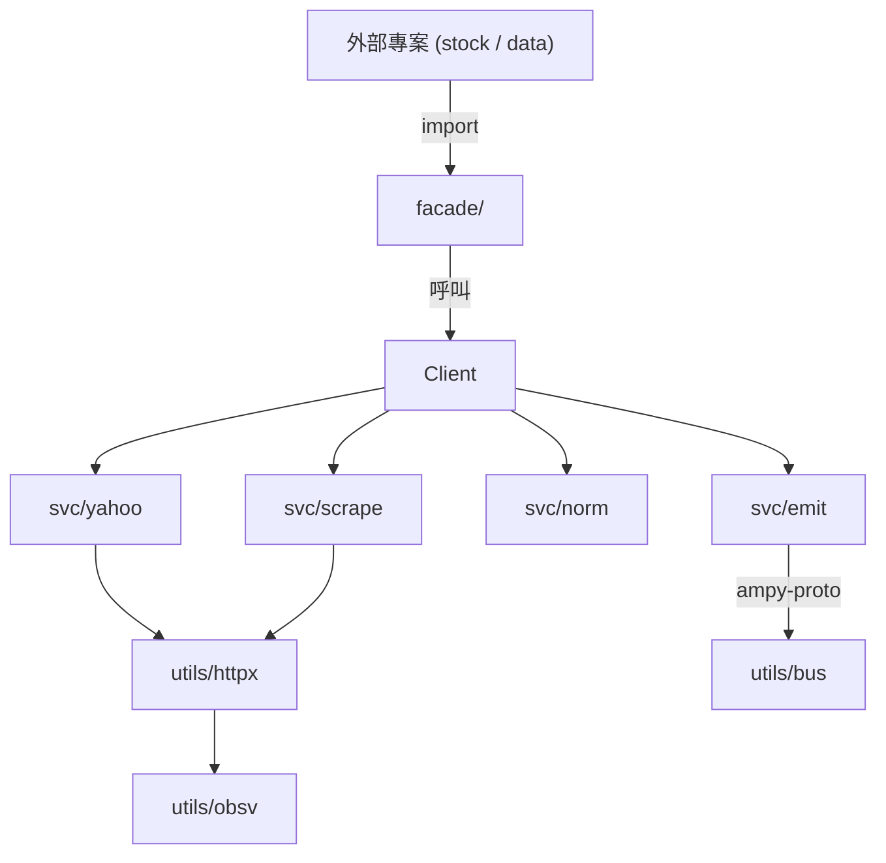

# yfin 入門指南 (Onboarding Guide)

新進成員從零到能送交第一個 PR 的最短路徑。本文件假設你已具備 Go 基礎與終端機操作經驗。

> 專案名稱為 `yfin`（曾用名 `yfinance-go`），模組路徑 `github.com/bizshuk/yfin`。

---

## 結論優先 (TL;DR)

- 這是 **Yahoo Finance 非官方 Go SDK + CLI**，提供 reflection-free 的 `facade.*` 資料模型給外部專案（`stock`、`data`）使用。
- 套件劃分嚴格：對外用 `facade/`；業務服務在 `svc/`（`yahoo`、`scrape`、`emit`、`norm`、`twse`）；底層在 `utils/`（`httpx`、`bus`、`cache`、`obsv`）。
- 設定路徑約定 `~/.config/yfin/`（由 `gosdk` 提供），觀測指標自動送往 `inf` 後端。
- 開始工作只需三步：`go test ./...` → `go build -o yfin ./cmd/yfin` → `./yfin --help`。

---

## 步驟 1：環境準備 (Step 1 — Environment Prerequisites)

### 1.1 Go 版本

模組宣告 `go 1.26.0`，需安裝 Go 1.26 或更新版本。

```bash
go version   # 應顯示 go1.26 或更新
```

### 1.2 取得原始碼

```bash
git clone git@github.com:bizshuk/yfin.git ~/projects/yfin
cd ~/projects/yfin
```

### 1.3 確認外部依賴已就位

`yfin` 依賴 `bizshuk/gosdk` 與 AmpyFin 生態（`ampy-bus`、`ampy-config`、`ampy-observability`）。首次拉取時 Go modules 會自動下載。

```bash
go mod download   # 預先下載所有依賴
```

### 1.4 設定目錄

依 `gosdk` 慣例，應用設定路徑固定為：

```tree
~/.config/yfin/
├── app.yaml             # 主要組態（連線池、限流、斷路器參數）
├── logs/                # stdout/stderr 日誌
└── data/                # 執行期產物（如有）
```

> 此目錄由 `gosdk/config` 自動建立，無需手動 mkdir。

---

## 步驟 2：建置與冒煙測試 (Step 2 — Build & Smoke Test)

### 2.1 編譯 CLI

```bash
go build -o yfin ./cmd/yfin
```

產出 `./yfin` 可執行檔。

### 2.2 驗證指令清單

```bash
./yfin --help
```

應看到子指令如 `fetch`、`batch`、`dispatch`、`twse`、`tools`、`samples`、`soak`。

### 2.3 跑單元測試

```bash
go test ./...
```

> 注意：`utils/obsv` 套件在本地環境可能有預存的 OTel schema 衝突失敗，這是已知問題，與本次改動無關。

### 2.4 整合測試（選用）

```bash
go test -tags=integration ./...
```

整合測試會實際打 Yahoo Finance 與 TWSE 開放資料，需可達外網。

### 2.5 程式碼風格

```bash
go fmt ./...
golangci-lint run
```

---

## 步驟 3：目錄導覽 (Step 3 — Repository Layout)

```tree
yfin/
├── main.go                    # 轉發 cmd.Execute() 的最薄殼
├── cmd/yfin/                  # CLI 進入點 + 子指令註冊（cobra）
│   ├── root.go                #   根指令、global flags
│   ├── dispatch.go            #   子指令分派表
│   ├── fetch.go               #   單股抓取
│   ├── batch.go               #   批次下載
│   ├── twse.go                #   TWSE 指令
│   ├── samples/               #   範例子指令
│   ├── soak/                  #   壓力測試工具
│   └── tools/                 #   輔助工具
├── facade/                    # ★ 對外契約層 — 外部專案只 import 這裡
│   ├── client.go              #   公開的 Client 結構 + 建構子
│   ├── bars.go                #   K 線資料 facade
│   ├── quote.go               #   即時報價 facade
│   ├── company_info.go        #   公司資訊 facade
│   ├── fundamentals.go        #   財務報表 facade
│   ├── market_data.go         #   市場資料 facade
│   └── news.go                #   新聞 facade
├── svc/                       # 業務服務層（SDK-first 設計）
│   ├── yahoo/                 #   Yahoo 原始 API 呼叫（Crumb 認證、chart API）
│   ├── scrape/                #   HTML 爬蟲（robots.txt 合規、補 API 缺欄位）
│   ├── emit/                  #   將正規化資料映射為 ampy-proto 並驗證
│   ├── norm/                  #   資料正規化（時區→UTC、MIC 推斷、ScaledDecimal 轉換）
│   └── twse/                  #   台灣證券交易所開放資料
├── utils/                     # 共用基礎設施
│   ├── httpx/                 #   彈性 HTTP：QPS 限流 + 指數退避 + 斷路器
│   ├── bus/                   #   ampy-bus 發佈器（含重試、分塊、信封）
│   ├── cache/                 #   資料更新頻率快取（daily/monthly/quarterly）
│   └── obsv/                  #   OpenTelemetry + Prometheus 指標
├── config/                    # ampy-config YAML 範本
├── tests/                     # 測試資產（integration/crosslang/python）
├── docs/                      # 文件（本檔所在）
├── facade/samples/            # facade 客戶端範例（建議從這裡開始讀）
└── cmd/yfin/samples/          # CLI 子指令範例
```

### 設計核心 — 為什麼這樣切？



- **`facade/` 是唯一對外可見的純資料層**；外部專案不應 import `svc/*` 或 `utils/*`。
- `svc/*` 之間允許互相呼叫（如 `emit` 引用 `norm`）；`utils/*` 不應 import `svc/*`。
- CLI（`cmd/yfin`）是唯一可以引用所有層的「組合根 (composition root)」。

---

## 步驟 4：第一次抓資料 (Step 4 — Your First Fetch)

四行程式碼完成一次 AAPL 日 K 抓取：

```go
package main

import (
    "context"
    "fmt"
    "log"
    "time"

    "github.com/bizshuk/yfin/facade"
)

func main() {
    client := facade.NewClient()
    ctx := context.Background()

    start := time.Date(2026, 1, 1, 0, 0, 0, 0, time.UTC)
    end := time.Date(2026, 1, 31, 0, 0, 0, 0, time.UTC)

    bars, err := client.FetchDailyBars(ctx, "AAPL", start, end, true, "my-run-id")
    if err != nil {
        log.Fatal(err)
    }

    fmt.Printf("Fetched %d bars\n", len(bars.Bars))
}
```

`FetchDailyBars` 的 `adjust` 參數為 `true` 時，會自動套用分割與股利回溯調整。

執行：

```bash
go run ./facade/samples/fetch_daily
```

---

## 步驟 5：常用工作流程 (Step 5 — Common Workflows)

### 5.1 新增一個 facade 欄位（例如：擴充 `facade.Bar`）

1. 修改 `facade/bars.go` 加上欄位（**純 struct、無方法、無 reflection**）。
2. 修改 `svc/yahoo/bars.go` 在解析原始 API 回應時填入該欄位。
3. 修改 `svc/emit/map_bars.go` 將該欄位映射到 `ampy-proto` 訊息。
4. 在 `facade/market_data_test.go` 加 golden 測試。
5. `go test ./... && go fmt ./... && golangci-lint run`。

### 5.2 新增一個 CLI 子指令

1. 在 `cmd/yfin/` 建立 `<name>.go`，宣告一個 `cobra.Command`。
2. 在 `cmd/yfin/root.go` 的 `init()` 中呼叫 `rootCmd.AddCommand(...)`。
3. 在 `cmd/yfin/<name>_test.go` 加 CLI 測試。
4. 更新 `docs/usage.md`。

### 5.3 調整 HTTP 限流參數

1. 修改 `utils/httpx/client.go` 的 `Config` 結構。
2. 修改 `config/example.prod.yaml` 對應的 ampy-config schema。
3. 修改 `config/ampy_config.go` 的解析邏輯，必要時加上驗證。
4. 透過 `obsv/metrics.go` 暴露新指標。

### 5.4 寫整合測試

在 `tests/integration/` 加 `_test.go` 檔，使用 build tag `integration` 標記：

```go
//go:build integration

package integration
```

此檔案只會在 `go test -tags=integration` 時編譯。

---

## 步驟 6：除錯與可觀測性 (Step 6 — Debug & Observability)

### 6.1 日誌位置

```bash
tail -f ~/.config/yfin/logs/yfin.log
```

所有 zap 日誌會同時送往：
- `~/.config/yfin/logs/`（檔案）
- `inf` Loki（透過 `gosdk/log` 預設值）

### 6.2 指標位置

HTTP 客戶端、斷路器、限流器的 Prometheus 指標會推送至 `inf` VictoriaMetrics（`:8428`）。

### 6.3 常見問題

| 症狀                                          | 原因                                          |
| --------------------------------------------- | --------------------------------------------- |
| `authentication failed`                       | Yahoo Crumb 過期 — 等待 cooldown 後重試      |
| HTTP 持續 429                                 | QPS 超過 `Config.QPS` 上限 — 降低 `QPS` 欄位 |
| `facade.Bar` 欄位為零值                       | 該 ticker 在 Yahoo 為 NoneType — 屬正常行為 |
| `tests/integration` 連線逾時                  | 需可達外網，或使用 `mock` 模式               |

---

## 術語解釋 (Terminology)

本專案的特定詞彙，首次出現於其他文件時需搭配本節理解。

| 術語                          | 意義                                                                                                                                              |
| ----------------------------- | ------------------------------------------------------------------------------------------------------------------------------------------------- |
| `facade`                      | 對外契約層（`facade/`）。提供 reflection-free 的 plain struct，外部專案（如 `stock`、`data`）只允許 import 此層，避免直接耦合 SDK 內部實作。   |
| `ScaledDecimal`               | 定點十進位精度模型。內部以 `(Scaled int64, Scale int32)` 表示金額，避免浮點誤差。對外由 `facade` 轉換為 `float64`。                              |
| `svc/`                        | SDK-first 業務服務層。每個子目錄（`yahoo`、`scrape`、`emit`、`norm`、`twse`）是一個獨立可單測的服務。                                            |
| `utils/`                      | 共用基礎設施層（`httpx`、`bus`、`cache`、`obsv`）。**不應 import `svc/*`**。                                                                     |
| `composition root`            | 組合根，唯一可以引用所有層的進入點（`cmd/yfin/*`、`main.go`）。                                                                                  |
| `MIC` (Market Identifier Code) | ISO 10383 市場識別碼。例：`XTAI` = 台灣證交所、`XASE` = 美國 NYSE American。當 API 未提供時，由 `svc/norm/security.go` 靜態推斷。                |
| `Crumb`                       | Yahoo Finance 的存取令牌（cookie + crumb 對）。由 `svc/yahoo/auth.go` 管理，會自動刷新並快取。                                                  |
| `emit`                        | 將正規化資料映射為 `ampy-proto` Protobuf 訊息並進行強健驗證的服務。例：OHLC 浮點微調、`low > close` 自癒。                                        |
| `norm`                        | 資料正規化：時區統一為 UTC、MIC 推斷、ScaledDecimal 轉換、市場時段判定。                                                                          |
| `httpx`                       | 彈性 HTTP 客戶端：QPS 限流（token bucket）、指數退避（exponential backoff with jitter）、斷路器（circuit breaker）。                            |
| `obsv`                        | 可觀測性封裝：OpenTelemetry tracing + Prometheus 指標。預設對接 `inf` 後端。                                                                    |
| `gosdk`                       | `bizshuk/gosdk`，跨專案共用 SDK。提供 config loader、logger、metric 預設值。                                                                    |
| `inf`                         | 全工作區的觀測後端：VictoriaMetrics（`:8428`）收指標、Loki（`:3100`）收日誌。                                                                   |
| `ampy-proto`                  | AmpyFin 定義的 Protobuf 訊息契約。`svc/emit` 是其前哨站，負責驗證版本與邊界。                                                                    |
| `robots.txt`                  | 遠端網站爬蟲協定。`svc/scrape/robots.go` 在每次抓取前先請求並快取，僅對被允許的路徑送出請求。                                                   |
| `keep-alive`                  | HTTP/1.1 連線復用。`httpx` 採單一共享 `http.Client` 以最大化連線池利用率。                                                                      |
| `jitter`                      | 退避時的隨機抖動，避免多客戶端同時重試造成的 thundering herd。                                                                                  |

---

## 參考連結 (See Also)

- `README.md` — 業務定義、安裝、快速開始
- `CLAUDE.md` — 技術脈絡、限制、約束
- `docs/tutorials/packages.md` — 各套件職責詳解（**注意**：此文件尚有舊 `internal/` 路徑殘留，閱讀時請以當前 `svc/` 與 `utils/` 為準）
- `docs/api-reference.md` — facade 公開 API 規格
- `docs/usage.md` — CLI 使用手冊
- `docs/observability.md` — 可觀測性細節
- `docs/data-quality.md` — 資料品質保證與探針
- `facade/samples/` — 可執行的最小範例
- `cmd/yfin/samples/` — CLI 子指令範例
