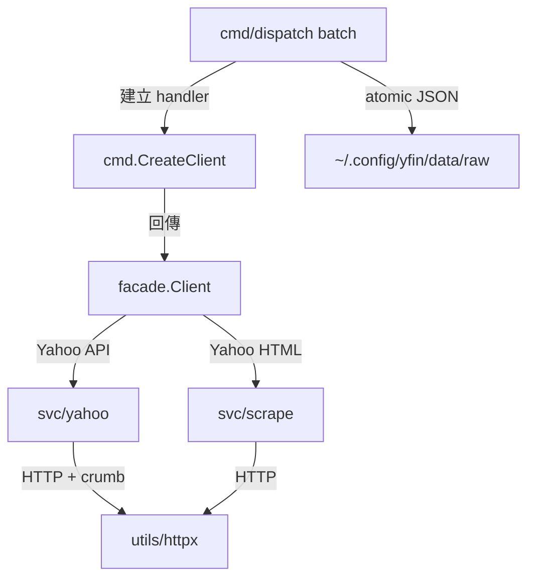

# Yahoo Finance 全資料維度遷移收斂 Implementation Plan

> **For agentic workers:** REQUIRED SUB-SKILL: Use `subagent-driven-development` (recommended) or `executing-plans` to implement this plan task-by-task. Steps use checkbox (`- [ ]`) syntax for tracking.

**Goal:** 在現行 `cmd → facade → svc → model` 架構內完成 Yahoo Finance 30 個資料維度的可執行批次遷移，使 `yfin batch` 具備有效認證、command-specific payload、可靠快取與落盤，以及可重複的 Python semantic parity 驗證。

**Architecture:** 保留已落地的 `svc/yahoo` fetch/decode 能力，由 `facade.Client` 作唯一跨層 handler；`cmd/dispatch` 只負責 command 編排、批次生命週期與 JSON artifact。Yahoo `cookie + crumb` 由共用 `utils/httpx.Client` 與 `svc/yahoo.CrumbManager` 處理，runtime data 固定寫入 `gosdk/config.GetAppDataDir()/raw`，不得耦合上層 `stock` 專案。

**Tech Stack:** Go 1.26.0、Cobra、stdlib `net/http` / `errors` / `embed` / `encoding/json`、`github.com/bizshuk/gosdk/config`、testify、Python yfinance（只用於手動 parity baseline）。

## Global Constraints

- 依賴方向固定為 `cmd → facade → svc → model`；`cmd` tree 不得 import `svc` packages。
- 不重建已移除的 `internal`、`svc/norm`、`internal/emit` 或 `cmd/yfin`。
- `model` 保持 lowest layer；`facade.Client` 是 CLI 與外部 SDK 的唯一 fetch handle。
- batch 必須由 `cmd.CreateClient()` 建立 client。
- runtime data 固定寫入 `~/.config/yfin/data/raw/`，不提供自訂 data root。
- Go payload 採現行 domain JSON，不追求 pandas byte-for-byte 格式，但每個 command 必須只回傳自己的資料維度。
- transient retry 只由 `utils/httpx` 負責；batch 不疊加 retry。
- 日期與 cache 判斷使用 UTC；不新增第三方 dependency。

---

## Current State

已完成且不重做：

- `utils/httpx.Client` 已具 cookie jar、QPS、backoff、circuit breaker。
- `svc/yahoo` 已具 crumb、quoteSummary及13組資料 fetch/decode。
- `facade.YahooDispatch` 已包住 `svc/yahoo`；現行 `cmd` tree沒有直接 import `svc`。
- `cmd/dispatch` 已有30-command registry、worker pool、refresh cache與stub unit test。

本計畫只處理下列真實缺口：

1. `httpx.Do` 回傳 plain HTTP error，quoteSummary無法可靠判斷401並rotate crumb。
2. production `yfin batch` 傳入nil `FetchContext`，會panic。
3. holders / insider / analysis aliases未做command-specific projection。
4. `DecodeInfo` 以map iteration合併module，collision結果不確定。
5. batch硬編碼 `~/.config/stock` 與不存在的cwd-relative ticker path。
6. marshal / mkdir / write error被忽略，仍標記success。
7. cache同時有舊檔與新檔時會錯判stale。
8. 測試未執行production wiring或semantic parity。



## File Structure

- Modify `utils/httpx/client.go` / tests — typed HTTP status。
- Modify `svc/yahoo/{client,auth,quotesummary,info}.go` / tests — default crumb、401 rotate、deterministic info。
- Modify `facade/yahoo.go`、`facade/client_scrape.go` / tests — command-specific projection。
- Modify `cmd/dispatch/{dispatch,batch}.go` / tests — ordered manifest與production runtime。
- Modify `utils/cache/{tickerlist,refresh}.go` / tests — reader-based CSV與newest artifact。
- Create `cmd/dispatch/output.go` / tests — atomic artifact writer。
- Create `cmd/dispatch/tickers.go`；move canonical CSV至 `cmd/dispatch/ticker_list.csv`。
- Create `cmd/dispatch/batch_integration_test.go`。
- Create `skills/scripts/compare_yfin_parity.py`、`scripts/verify-yf-parity.sh`。
- Modify `README.md`、`CLAUDE.md`、`skills/SKILL.md`、`docs/cli/{usage,commands}.md`。

---

### Task 1: Typed HTTP status 與 crumb rotation

**Files:**

- Modify: `utils/httpx/client.go:166-212`
- Modify: `utils/httpx/client_test.go`
- Modify: `svc/yahoo/client.go:17-41`
- Modify: `svc/yahoo/auth.go:55-75`
- Modify: `svc/yahoo/quotesummary.go:13-55`
- Modify: `svc/yahoo/{auth,quotesummary}_test.go`

**Interfaces:**

- Consumes: `httpx.NewHTTPError(statusCode int, message string, err error) *HTTPError`
- Produces: non-2xx可由 `errors.As` 取得status；`yahoo.NewClient` 預設具crumb manager。

- [x] **Step 1: 寫失敗測試**

`utils/httpx/client_test.go`：

```go
func TestClientDoReturnsTypedHTTPError(t *testing.T) {
    srv := httptest.NewServer(http.HandlerFunc(func(w http.ResponseWriter, _ *http.Request) {
        http.Error(w, "unauthorized", http.StatusUnauthorized)
    }))
    defer srv.Close()
    cfg := DefaultConfig()
    cfg.MaxAttempts, cfg.Burst, cfg.QPS = 1, 100, 100
    req, err := http.NewRequest(http.MethodGet, srv.URL, nil)
    require.NoError(t, err)
    _, err = NewClient(cfg).Do(context.Background(), req)
    var statusErr *HTTPError
    require.ErrorAs(t, err, &statusErr)
    require.Equal(t, http.StatusUnauthorized, statusErr.StatusCode)
}
```

`svc/yahoo/quotesummary_test.go` 新增server scenario：第一次quoteSummary回401，第二次成功；斷言 `getcrumb` 呼叫兩次，第二次request使用新crumb。

- [x] **Step 2: 確認測試失敗**

```bash
go test ./utils/httpx ./svc/yahoo -run 'TestClientDoReturnsTypedHTTPError|TestFetchQuoteSummaryRotatesCrumbOnceOn401' -v
```

Expected: typed error或rotation assertion失敗。

- [x] **Step 3: 最小實作**

`utils/httpx/client.go` 的response status error改用：

```go
lastErr = NewHTTPError(resp.StatusCode, http.StatusText(resp.StatusCode), nil)
```

`svc/yahoo/client.go::NewClient` 加入：

```go
crumb: NewCrumbManager(httpClient, "", ""),
```

`bootstrapCookie` 接受typed 403：

```go
resp, err := m.httpClient.Do(ctx, req)
if err != nil {
    var statusErr *httpx.HTTPError
    if errors.As(err, &statusErr) && statusErr.StatusCode == http.StatusForbidden {
        return nil
    }
    return fmt.Errorf("cookie bootstrap failed: %w", err)
}
defer resp.Body.Close()
return nil
```

`FetchQuoteSummary` 只對typed 401 invalidate並重試一次；`doQuoteSummary` 簽名收斂為 `([]byte, error)`。

- [x] **Step 4: 驗證**

```bash
go test ./utils/httpx ./svc/yahoo ./facade -v
```

Expected: 全部PASS；401 scenario只rotate一次。

- [x] **Step 5: Commit**

```bash
git add utils/httpx/client.go utils/httpx/client_test.go svc/yahoo/client.go svc/yahoo/auth.go svc/yahoo/auth_test.go svc/yahoo/quotesummary.go svc/yahoo/quotesummary_test.go
git commit -m "fix(yahoo): wire typed status errors into crumb rotation"
```

---

### Task 2: Command-specific Yahoo payload 與 deterministic info

**Files:**

- Modify: `svc/yahoo/info.go` / tests
- Modify: `facade/yahoo.go`
- Create: `facade/yahoo_test.go`

**Interfaces:**

- Produces: holders / insider aliases各自回傳自己的維度。
- Preserves: `earnings-dates → FetchEarningsDates`、`calendar → FetchCalendar`。

- [ ] **Step 1: 寫失敗測試**

```go
func TestDecodeInfoUsesInfoModulesOrder(t *testing.T) {
    raw := []byte(`{"quoteSummary":{"result":[{
      "assetProfile":{"shared":"profile"},
      "financialData":{"shared":"financial"},
      "quoteType":{"shared":"quote"}
    }],"error":null}}`)
    for i := 0; i < 50; i++ {
        got, err := DecodeInfo(raw)
        require.NoError(t, err)
        require.Equal(t, "quote", got["shared"])
    }
}
```

在 `facade/yahoo_test.go` 以DTO測 `projectHolders` / `projectInsider`：major、institution、fund、transactions、purchase summary、roster必須得到不同payload。

- [ ] **Step 2: 確認測試失敗**

```bash
go test ./svc/yahoo ./facade -run 'TestDecodeInfoUsesInfoModulesOrder|TestProjectHolders|TestProjectInsider' -v
```

- [ ] **Step 3: 最小實作**

`DecodeInfo` 依 `InfoModules` 固定順序合併，後列module覆蓋前列。新增：

```go
func projectHolders(command string, dto *yahoo.HoldersDTO) (any, error) {
    switch command {
    case "major-holders":
        return dto.MajorDirectHolders, nil
    case "institutional-holders":
        return dto.InstitutionOwnership, nil
    case "mutualfund-holders":
        return dto.FundOwnership, nil
    default:
        return nil, fmt.Errorf("unsupported holders command %q", command)
    }
}

func projectInsider(command string, dto *yahoo.InsiderDTO) (any, error) {
    switch command {
    case "insider-transactions":
        return dto.Transactions, nil
    case "insider-purchases":
        return yahoo.InsiderPurchaseSummaryTable(&dto.PurchaseActivity), nil
    case "insider-roster":
        return dto.Roster, nil
    default:
        return nil, fmt.Errorf("unsupported insider command %q", command)
    }
}
```

`YahooDispatch` 先fetch再投影，不在 `cmd` type assert任何 `svc` DTO。

- [ ] **Step 4: 驗證**

```bash
go test ./svc/yahoo ./facade -v
go list -f '{{.ImportPath}} {{join .Imports " "}}' ./cmd/... | grep svc/ && exit 1 || true
```

Expected: tests PASS；architecture check無輸出。

- [ ] **Step 5: Commit**

```bash
git add svc/yahoo/info.go svc/yahoo/info_test.go facade/yahoo.go facade/yahoo_test.go
git commit -m "fix(facade): return command-specific yahoo payloads"
```

---

### Task 3: Analysis六維度與ordered command manifest

**Files:**

- Modify: `facade/client_scrape.go` / tests
- Modify: `cmd/dispatch/dispatch.go` / tests

**Interfaces:**

- Produces: `ScrapeAnalysisData(ctx, symbol, runID) (*model.ComprehensiveAnalysisDTO, error)`
- Produces: `ScrapeAnalysisDimension(ctx, command, symbol, runID) (any, error)`
- Produces: `commandOrder []string`，恰好含Python `COMMANDS` 的30個名稱。

- [ ] **Step 1: 寫失敗測試**

測試 `projectAnalysisDimension` 分別回傳 `EarningsHistory`、`EPSTrend`、`EPSRevisions`、`EarningsEstimate`、`RevenueEstimate`、`GrowthEstimate`。`dispatch_test.go` assert registry與order長度皆30，且順序逐項等於 `skills/scripts/config.py`。

- [ ] **Step 2: 確認失敗**

```bash
go test ./facade ./cmd/dispatch -run 'TestProjectAnalysisDimension|TestCommandRegistryMatchesPythonManifest' -v
```

- [ ] **Step 3: 最小實作**

抽出現有analysis fetch/parse：

```go
func (c *Client) ScrapeAnalysisData(ctx context.Context, symbol, runID string) (*model.ComprehensiveAnalysisDTO, error) {
    url := fmt.Sprintf("https://finance.yahoo.com/quote/%s/analysis", symbol)
    body, _, err := c.scrapeClient.Fetch(ctx, url)
    if err != nil {
        return nil, fmt.Errorf("failed to fetch analysis: %w", err)
    }
    mic := c.inferMICForSymbol(ctx, symbol)
    dto, err := scrape.ParseAnalysis(body, symbol, mic)
    if err != nil {
        return nil, fmt.Errorf("failed to parse analysis: %w", err)
    }
    return dto, nil
}
```

新增pure projection switch；`ScrapeAnalysis`改用上述helper後轉snapshot。registry六個analysis command改呼叫 `ScrapeAnalysisDimension`。batch後續只依 `commandOrder` 執行，不range map。

- [ ] **Step 4: 驗證**

```bash
go test ./facade ./cmd/dispatch ./svc/scrape ./model -v
```

- [ ] **Step 5: Commit**

```bash
git add facade/client_scrape.go facade/client_scrape_test.go cmd/dispatch/dispatch.go cmd/dispatch/dispatch_test.go
git commit -m "fix(dispatch): project analysis commands into distinct payloads"
```

---

### Task 4: Production batch wiring、embedded universe與cancellation

**Files:**

- Modify: `cmd/dispatch/batch.go` / tests
- Create: `cmd/dispatch/tickers.go`
- Move: `skills/references/ticker_list.csv` → `cmd/dispatch/ticker_list.csv`
- Modify: `utils/cache/tickerlist.go` / tests
- Modify: `skills/scripts/all_ticker_yf.py`

**Interfaces:**

- Produces: `batchDeps` 注入client、clock、data directory、ticker source與registry。
- Produces: `cache.ReadTickerList(r io.Reader) ([]string, error)`，供embedded與測試來源共用。
- Production: `newProductionBatchDeps()` 使用 `cmd.CreateClient()` 與 `sdkconfig.GetAppDataDir()`。

- [ ] **Step 1: 寫失敗測試**

測試 `max-workers <= 0` 回 `"max-workers must be greater than zero"`；reader-based CSV parser正確忽略空值；embedded universe包含 `2330.TW`；注入fake deps執行Cobra command時fetcher收到非nil `FetchContext.Root`。

- [ ] **Step 2: 確認失敗**

```bash
go test ./utils/cache ./cmd/dispatch -run 'TestReadTickerList|TestRunBatchRejectsNonPositiveWorkers|TestReadEmbeddedTickerList|TestBatchCommandUsesInjectedClient' -v
```

- [ ] **Step 3: 最小實作**

```go
type batchOptions struct {
    ticker     string
    maxWorkers int
    force      bool
}

type batchDeps struct {
    newClient   func() (*facade.Client, error)
    dataDir     func() string
    readTickers func() ([]string, error)
    now         func() time.Time
    registry    map[string]fetchFunc
}

func newProductionBatchDeps() batchDeps {
    return batchDeps{
        newClient: cmd.CreateClient,
        dataDir: sdkconfig.GetAppDataDir,
        readTickers: readEmbeddedTickerList,
        now: func() time.Time { return time.Now().UTC() },
        registry: commandRegistry,
    }
}
```

`Register` 使用 `newBatchCmd(newProductionBatchDeps())`；`RunE` 傳 `cobra.Command.Context()`。`runBatch` 必須：

- validate workers；
- 建立real facade client；
- 每個ticker使用非nil `FetchContext`；
- 依 `commandOrder` 執行；
- root為 `filepath.Join(deps.dataDir(), "raw")`；
- cancellation後停止派送新ticker。

`ReadTickerList` 先改用 `encoding/csv` + `io.Reader`。`ticker_list.csv` 以 `git mv` 移到 `cmd/dispatch`，由 `go:embed` 載入；legacy Python oracle同步改讀新canonical path。

- [ ] **Step 4: 驗證**

```bash
go test ./utils/cache ./cmd/dispatch ./cmd -v
go build .
```

Expected: 不再含production `~/.config/stock` 或 `yf/references/ticker_list.csv`。

- [ ] **Step 5: Commit**

```bash
git add cmd/dispatch/batch.go cmd/dispatch/batch_test.go cmd/dispatch/tickers.go cmd/dispatch/ticker_list.csv utils/cache/tickerlist.go utils/cache/tickerlist_test.go skills/scripts/all_ticker_yf.py
git commit -m "fix(batch): wire production facade client and embedded universe"
```

---

### Task 5: Atomic output與newest-cache semantics

**Files:**

- Create: `cmd/dispatch/output.go` / tests
- Modify: `cmd/dispatch/batch.go` / tests
- Modify: `utils/cache/refresh.go` / tests

**Interfaces:**

- Produces: `writeJSONAtomic(path string, value any) error`
- Produces: `writeErrorAtomic(path string, err error) error`
- Preserves: `cache.ShouldSkip(...) bool`

- [ ] **Step 1: 寫失敗測試**

建立old+new兩個artifact，assert cache以newest判fresh。傳入不可marshal的function，assert target不存在。另測write失敗時status不是success。

- [ ] **Step 2: 確認失敗**

```bash
go test ./utils/cache ./cmd/dispatch -run 'TestShouldSkipUsesNewestArtifact|TestWriteJSONAtomic|TestRunBatchForTickerReportsWriteFailure' -v
```

- [ ] **Step 3: 最小實作**

`ShouldSkip` 選最大valid date後判tier。新增atomic writer：

```go
func writeJSONAtomic(path string, value any) error {
    data, err := json.MarshalIndent(value, "", "  ")
    if err != nil {
        return fmt.Errorf("marshal %s: %w", path, err)
    }
    return writeBytesAtomic(path, append(data, '\n'))
}

func writeBytesAtomic(path string, data []byte) error {
    if err := os.MkdirAll(filepath.Dir(path), 0o755); err != nil {
        return fmt.Errorf("create output directory: %w", err)
    }
    f, err := os.CreateTemp(filepath.Dir(path), ".yfin-*.tmp")
    if err != nil {
        return fmt.Errorf("create temporary output: %w", err)
    }
    tmp := f.Name()
    defer os.Remove(tmp)
    if _, err := f.Write(data); err != nil {
        _ = f.Close()
        return err
    }
    if err := f.Sync(); err != nil {
        _ = f.Close()
        return err
    }
    if err := f.Close(); err != nil {
        return err
    }
    return os.Rename(tmp, path)
}
```

移除batch-level retry。HTTP 404/422分類為not_found；其他為failed。只有atomic write成功才設success；error artifact寫入失敗必須回報。

- [ ] **Step 4: 驗證race**

```bash
go test -race ./utils/cache ./cmd/dispatch -v
```

- [ ] **Step 5: Commit**

```bash
git add cmd/dispatch/output.go cmd/dispatch/output_test.go cmd/dispatch/batch.go cmd/dispatch/batch_test.go utils/cache/refresh.go utils/cache/refresh_test.go
git commit -m "fix(batch): make artifacts atomic and cache deterministic"
```

---

### Task 6: 30-command semantic parity gate與文件同步

**Files:**

- Create: `cmd/dispatch/batch_integration_test.go`
- Create: `skills/scripts/compare_yfin_parity.py`
- Create: `scripts/verify-yf-parity.sh`
- Modify: `README.md`、`CLAUDE.md`、`skills/SKILL.md`、`docs/cli/usage.md`、`docs/cli/commands.md`

**Interfaces:**

- CI gate：無外網，injected 30-entry registry驗證lifecycle、artifacts、failure與cancellation。
- Manual gate：同一symbol / UTC date執行Python oracle與Go batch，檢查artifact存在、JSON有效、空值語意與top-level type。

- [ ] **Step 1: 寫lifecycle integration test**

以30-entry fake registry執行 `runBatch`，逐一assert：

```text
<temp>/raw/<command>/AAPL.2026-07-16.json
```

內容必須含對應command與symbol。另測任一failed command令CLI回non-zero，但已成功artifact保留。

- [ ] **Step 2: 實作manual comparator**

`compare_yfin_parity.py` 逐一讀 `config.COMMANDS`：

- Python / Go artifact皆須存在且可解析。
- 比較empty / non-empty semantics。
- holders、transactions、roster、recommendations、upgrades、earnings-dates、SEC filings的Go top-level必須為list。
- insider-purchases、info、calendar、sustainability、metadata必須為object。
- 任一mismatch列出command並exit 1。

`verify-yf-parity.sh`：

```bash
#!/usr/bin/env bash
set -euo pipefail
ticker="${1:-AAPL}"
day="$(date -u +%F)"
python3 skills/scripts/all_ticker_yf.py --ticker "${ticker}" --force --max-workers 1
go run . batch --ticker "${ticker}" --force --max-workers 1
python3 skills/scripts/compare_yfin_parity.py \
  --python-root "${HOME}/.config/stock/data/raw" \
  --go-root "${HOME}/.config/yfin/data/raw" \
  --ticker "${ticker}" \
  --day "${day}"
```

`~/.config/stock` 只允許存在於legacy oracle，不得出現在Go production code。

- [ ] **Step 3: deterministic verification**

```bash
go test ./...
go build .
go list -f '{{.ImportPath}} {{join .Imports " "}}' ./cmd/... | grep svc/ && exit 1 || true
```

- [ ] **Step 4: manual smoke與文件同步**

```bash
./scripts/verify-yf-parity.sh AAPL
./scripts/verify-yf-parity.sh 2330.TW
```

兩次exit 0後才更新文件：

- runtime path改為 `~/.config/yfin/data/raw`；
- `go run ./cmd/yfin batch`改為 `go run . batch`；
- Python script標為oracle；
- 記錄ordered manifest、atomic output、non-zero failure behavior與parity gate。

- [ ] **Step 5: Commit**

```bash
git add cmd/dispatch/batch_integration_test.go skills/scripts/compare_yfin_parity.py scripts/verify-yf-parity.sh README.md CLAUDE.md skills/SKILL.md docs/cli/usage.md docs/cli/commands.md
git commit -m "test(docs): gate and document yahoo 30-command parity"
```

---

## Final Acceptance Criteria

- [ ] `go test -race ./...` PASS。
- [ ] `go build .` PASS。
- [ ] `cmd` tree對 `svc` direct import edge為0。
- [ ] `yfin batch --ticker AAPL --max-workers 1` 不panic，使用 `cmd.CreateClient()`。
- [ ] default universe由embedded `cmd/dispatch/ticker_list.csv`提供，不依賴cwd。
- [ ] runtime artifacts只寫 `~/.config/yfin/data/raw`。
- [ ] holders、insider、analysis aliases各自回傳獨立維度。
- [ ] info collision precedence deterministic。
- [ ] I/O error不會標記success；target只以atomic rename發布。
- [ ] cache以newest valid artifact判freshness。
- [ ] cancellation停止新worker；non-positive workers回config error。
- [ ] AAPL與2330.TW的30-command semantic parity smoke皆exit 0。
- [ ] README、CLAUDE.md、skills與CLI docs無舊路徑或未驗證宣告。

## Rollback Boundaries

| Task | 可獨立回滾內容 | 不受影響範圍 |
| --- | --- | --- |
| 1 | typed HTTP error + crumb wiring | chart API、scrape parser、CLI layout |
| 2 | Yahoo projection + info order | worker、cache、filesystem |
| 3 | analysis projection + command order | auth、artifact path |
| 4 | production wiring + embedded universe | decoders、model types |
| 5 | atomic output + cache | facade fetch contracts |
| 6 | parity scripts、integration gate、docs | production runtime code |

每個task完成後均須保持可編譯、可測試；不得把production wiring推遲到文件或驗證task。
