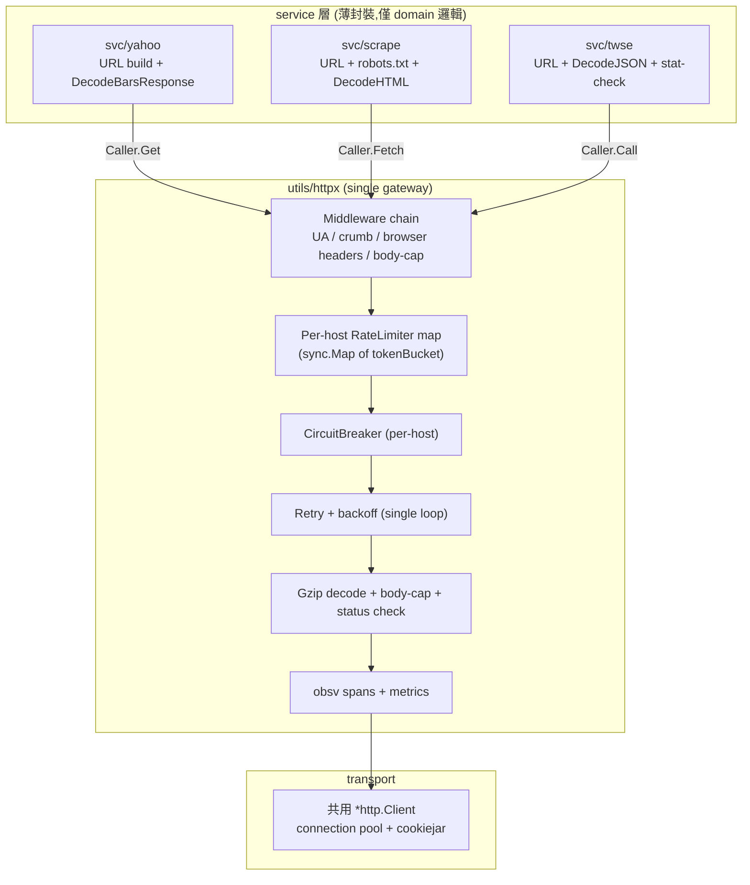

# Unify 外部存取客戶端 (Unify External Access Clients)

> **For agentic workers:** REQUIRED SUB-SKILL: Use superpowers:subagent-driven-development (recommended) or superpowers:executing-plans to implement this plan task-by-task. Steps use checkbox (`- [ ]`) syntax for tracking.

**Goal:** 把 `svc/twse/`、`svc/scrape/`、`svc/yahoo/` 三個服務對外的 HTTP 存取層,統一收斂到 `utils/httpx/` 作為 single external access gateway;消除目前重複的 retry loop、rate limiter、tracer、metrics 與 endpoint tagging。

**Architecture:**

- `utils/httpx` 為 single gateway:負責 retry / backoff / rate limit / circuit breaker / gzip / body cap / 觀測 / endpoint tagging。
- 三個 service 層只保留 domain 邏輯(URL build、decode、stat check、robots.txt、auth injection)。
- 共用 connection pool:三個 service 共用同一個 `*http.Client`,只在 limiter / middleware 層按 host 分區。
- 中介層 (middleware) 取代「每個方法手動設 header / cookie」的散落樣式。

**Tech Stack:** Go 1.26+、`utils/httpx`、`utils/obsv`、`sync.Map`(per-host limiter)、`compress/gizp`(由 httpx 內建處理)。

**Refresh tiers / rate limiting:** 由 `HostProfile` 設定,每個 host 獨立 token bucket:

- `query1.finance.yahoo.com` — qps=1.0, burst=3(chart API)
- `finance.yahoo.com` — qps=0.7, burst=1(scrape HTML)
- `www.twse.com.tw` — qps=2.0, burst=4(政府網站,頻寬容忍)

---

## 現況盤點 (Current State)

### 三個 client 的不一致樣式

| 層            | Transport                            | Retry           | Rate-limit         | Circuit | Trace             | Metrics            | Body cap | Auth                 |
| ------------- | ------------------------------------ | --------------- | ------------------ | ------- | ----------------- | ------------------ | -------- | -------------------- |
| `svc/yahoo/`  | `httpx.Client` 共用                  | ✅ in httpx     | ✅ in httpx        | ✅      | ✅ via obsv       | ✅ via obsv        | ❌       | crumb 手動           |
| `svc/scrape/` | `httpx.Client` 共用                  | ❌ **own loop** | ❌ **own limiter** | ✅      | ❌ **own Tracer** | ❌ **own Metrics** | ✅ 8 MiB | browser headers 手動 |
| `svc/twse/`   | `net/http` via `config.HTTPClient()` | ❌ none         | ❌ none            | ❌      | ❌                | ❌                 | ❌       | UA only              |

### 痛點

1. **Stacked retries**:`svc/scrape` 的 4 次重試 wrap 在 `httpx.Client.Do` 的 3 次重試外面,單次 fetch 最多 12 次 HTTP 呼叫。
2. **Double rate-limit**:`svc/scrape` 自己有 `RateLimiter`,跟 `httpx.Client` 的 limiter 同時生效,各自一個 bucket。
3. **Double observability**:`svc/scrape` 自有 `Metrics` / `Tracer` / `Logger`,每次 fetch 同時被兩層記錄,metric cardinality 翻倍。
4. **`extractEndpoint` 只認 Yahoo**:`utils/httpx/client.go` 的 endpoint 提取器只懂 Yahoo Finance 的路徑;scrape 跟 twse 全部顯示為 `"unknown"`。
5. **`Caller.Call` 在 service 層是死碼**:`svc/yahoo/client.go` 14 個方法都手動 `url.Parse → NewRequest → Do → Decode`,完全沒用到 `caller.go` 已提供的 helper。
6. **Connection pool 共用但 limiter 不分區**:Yahoo 跟 TWSE 共用同一個 token bucket,一個 host 尖峰會餓死另一個。

---

## 目標架構 (Target Architecture)



### `Caller` interface 升級

```go
// utils/httpx/caller.go (擴充)
type Caller interface {
    // GET BaseURL+path with query,回 body bytes + fetch metadata
    Get(ctx context.Context, path string, query url.Values) ([]byte, *Meta, error)
    // 進階場景 escape hatch(目前 yahoo.fetchChartRaw 使用)
    Do(ctx context.Context, req *http.Request) (*http.Response, error)
}

type Meta struct {
    Status   int
    Bytes    int
    Duration time.Duration
    Attempts int
    Host     string
    Endpoint string  // tagged:"yahoo:bars_1d"、"twse:STOCK_DAY"、"scrape:financials"
    Gzip     bool
}
```

### `Middleware` chain

```go
// utils/httpx/middleware.go (新增)
type RequestMiddleware func(req *http.Request, meta *Meta) error
type ResponseMiddleware func(resp *http.Response, meta *Meta)

func (c *Client) Use(mw ...RequestMiddleware)
func (c *Client) UseAfter(mw ...ResponseMiddleware)

// 每個 service 的 middleware factory:
func YahooMiddleware(cm *CrumbManager) RequestMiddleware       // 注入 crumb cookie
func ScrapeMiddleware() RequestMiddleware                      // browser-like headers
func TWSEMiddleware() RequestMiddleware                        // 固定 UA
```

### `HostProfile`(per-host 設定)

```go
// utils/httpx/profile.go (新增)
type HostProfile struct {
    Host       string
    EndpointFn func(path string) string  // 把 path 對映到 endpoint tag
    QPS        float64
    Burst      int
    MaxBody    int64                     // bytes;0 = unlimited
    UserAgent  string
    Headers    http.Header               // 預設 headers
}

var (
    YahooProfile  = HostProfile{Host: "query1.finance.yahoo.com", QPS: 1.0, Burst: 3, ...}
    YahooHTMLProfile = HostProfile{Host: "finance.yahoo.com", QPS: 0.7, Burst: 1, MaxBody: 8 << 20, ...}
    TWSEProfile   = HostProfile{Host: "www.twse.com.tw", QPS: 2.0, Burst: 4, ...}
)
```

### `PerHostLimiter`

```go
// utils/httpx/ratelimiter.go (改寫)
type PerHostLimiter struct {
    limiters sync.Map  // host → *tokenBucket
    profiles sync.Map  // host → *HostProfile
    mu       sync.RWMutex
}

func (l *PerHostLimiter) Wait(ctx context.Context, host string) error
func (l *PerHostLimiter) Register(profile HostProfile)
```

---

## Task 1: Body-cap 與 gzip 收進 httpx

> **目標:** scrape 獨有的 8 MiB 限制 + 手動 gzip decode 搬進 `httpx.Client`。
>
> **Pre-flight note:** `Config` struct 目前定義在 `utils/httpx/client.go`(行 19),並無獨立的 `config.go`;`MaxBodyBytes` 加在 `client.go` 既有的 `Config` 內。

**Files:**

- Modify: `utils/httpx/client.go`(在 `Config` struct 加 `MaxBodyBytes` 欄位)
- New: `utils/httpx/body.go`(gzip + size limit + `ErrBodyTooLarge` sentinel)
- Modify: `utils/httpx/caller.go`(在 `Call` 裡套用 body 處理;signature 維持 `([]byte, error)` 直至 Task 2 統一遷移)
- Test: `utils/httpx/body_test.go`

### Step 1: 在 `Config` 加 `MaxBodyBytes`

```go
// utils/httpx/client.go(修改既有 Config struct,非獨立 config.go)
type Config struct {
    // ...既有欄位...
    MaxBodyBytes int64  // 0 = unlimited;預設 0
}
```

### Step 2: 寫失敗測試:body 超過上限要回傳 error

```go
// utils/httpx/body_test.go
func TestCall_RejectsOversizedBody(t *testing.T) {
    // httptest server 回 10 MB body
    // httpx.Config.MaxBodyBytes = 1 MB
    // 期望:回傳 ErrBodyTooLarge
}
```

### Step 3: 實作 body-cap + gzip auto-decode

```go
// utils/httpx/body.go
package httpx

import (
    "compress/gzip"
    "errors"
    "fmt"
    "io"
)

var ErrBodyTooLarge = errors.New("httpx: response body exceeds MaxBodyBytes")

// readBody 處理 gzip + size cap,回 (body, encoding, err)
func readBody(resp *http.Response, maxBytes int64) ([]byte, error) {
    defer resp.Body.Close()
    var reader io.Reader = resp.Body
    if resp.Header.Get("Content-Encoding") == "gzip" {
        gz, err := gzip.NewReader(resp.Body)
        if err != nil {
            return nil, fmt.Errorf("httpx: gzip reader: %w", err)
        }
        defer gz.Close()
        reader = gz
    }
    if maxBytes > 0 {
        reader = io.LimitReader(reader, maxBytes+1)  // +1 偵測超限
    }
    body, err := io.ReadAll(reader)
    if err != nil {
        return nil, fmt.Errorf("httpx: read body: %w", err)
    }
    if maxBytes > 0 && int64(len(body)) > maxBytes {
        return nil, ErrBodyTooLarge
    }
    return body, nil
}
```

### Step 4: `Caller.Call` 套用 body 處理

```go
// utils/httpx/caller.go
func (c *Client) Call(ctx context.Context, path string, query url.Values) ([]byte, error) {
    // ...既有 URL/req 邏輯...
    resp, err := c.Do(ctx, req)
    if err != nil { return nil, err }
    if resp.StatusCode/100 != 2 {
        // 2xx 以外維持 io.LimitReader 1024 bytes 截斷
        body, _ := io.ReadAll(io.LimitReader(resp.Body, 1024))
        return nil, fmt.Errorf("httpx: status %d: %s", resp.StatusCode, string(body))
    }
    return readBody(resp, c.config.MaxBodyBytes)
}
```

### Step 5: 驗證既有測試不破

```bash
go test ./utils/httpx/... ./svc/yahoo/... ./svc/scrape/...
```

- [ ] Task 1 完成,所有既有測試通過
- [ ] 新增的 `body_test.go` 通過

---

## Task 2: Middleware chain + HostProfile

> **目標:** 引入 `Middleware` 機制,把 UA / crumb / browser headers 從「每個 method 重複」變成「註冊一次」。

**Files:**

- New: `utils/httpx/middleware.go`
- New: `utils/httpx/profile.go`
- Modify: `utils/httpx/client.go`(在 `Do` 內執行 middleware chain)
- New: `utils/httpx/middleware_test.go`
- Modify: `utils/httpx/errors.go`(新增 `ErrMiddleware` sentinel)

### Step 1: 寫失敗測試:middleware 執行順序與錯誤傳遞

```go
// utils/httpx/middleware_test.go
func TestMiddleware_OrderingAndError(t *testing.T) {
    var order []string
    c := httpx.NewClient(nil)
    c.Use(func(req *http.Request, meta *httpx.Meta) error {
        order = append(order, "first")
        req.Header.Set("X-Step", "1")
        return nil
    })
    c.Use(func(req *http.Request, meta *httpx.Meta) error {
        order = append(order, "second")
        return errors.New("blocked")
    })
    // 期望:order = ["first", "second"],回傳的 error 包含 "blocked"
}
```

### Step 2: 實作 `Middleware` 型別與註冊 API

```go
// utils/httpx/middleware.go
package httpx

import "net/http"

type RequestMiddleware func(req *http.Request, meta *Meta) error
type ResponseMiddleware func(resp *http.Response, meta *Meta)

type Client struct {
    // ...既有欄位...
    reqMW  []RequestMiddleware
    respMW []ResponseMiddleware
}

func (c *Client) Use(mw ...RequestMiddleware) {
    c.reqMW = append(c.reqMW, mw...)
}

func (c *Client) UseAfter(mw ...ResponseMiddleware) {
    c.respMW = append(c.respMW, mw...)
}

// runRequestMW 依序執行 req middleware,任何錯誤立刻返回
func (c *Client) runRequestMW(req *http.Request, meta *Meta) error {
    for i, mw := range c.reqMW {
        if err := mw(req, meta); err != nil {
            return fmt.Errorf("middleware[%d]: %w", i, err)
        }
    }
    return nil
}

func (c *Client) runResponseMW(resp *http.Response, meta *Meta) {
    for _, mw := range c.respMW {
        mw(resp, meta)
    }
}
```

### Step 3: 在 `Do` 內執行 middleware

```go
// utils/httpx/client.go - func (c *Client) Do
func (c *Client) Do(ctx context.Context, req *http.Request) (*http.Response, error) {
    meta := &Meta{Host: req.URL.Host}
    // ...既有 endpoint 提取...
    if err := c.runRequestMW(req, meta); err != nil {
        return nil, err
    }
    // ...既有 retry/circuit/rate-limit 邏輯...
    // 在拿到 resp 後(成功 path):
    c.runResponseMW(resp, meta)
    return resp, nil
}
```

### Step 4: 實作 `HostProfile` 型別

```go
// utils/httpx/profile.go
package httpx

import "net/http"

type HostProfile struct {
    Host       string
    EndpointFn func(path string) string
    QPS        float64
    Burst      int
    MaxBody    int64
    UserAgent  string
    Headers    http.Header
}

// CommonEndpointFn 把 path 的第一個 segment 當 endpoint tag
func CommonEndpointFn(path string) string {
    // 去掉 leading slash,取第一個非空 segment
    for len(path) > 0 && path[0] == '/' { path = path[1:] }
    if i := strings.IndexByte(path, '/'); i >= 0 { path = path[:i] }
    if path == "" { return "root" }
    return path
}
```

### Step 5: 驗證 middleware 測試通過

```bash
go test ./utils/httpx/... -run Middleware
```

- [ ] Task 2 完成,middleware 測試全綠
- [ ] `HostProfile` 型別就定位(尚未被使用)

---

## Task 3: Scrape 刪除重複的 retry/limiter/trace/metrics

> **目標:** `svc/scrape/client.go` 改成只剩「robots.txt gate + 把 request 交給 httpx」。

**Files:**

- Modify: `svc/scrape/client.go`
- Delete: `svc/scrape/backoff.go`(併入 httpx)
- Delete: `svc/scrape/metrics.go`(由 httpx 統一處理)
- Delete: `svc/scrape/trace.go`(由 httpx 統一處理)
- Delete: `svc/scrape/logging.go`(由 httpx 統一處理)
- Keep: `svc/scrape/robots.go`(唯一保留的 domain 元件)
- Keep: `svc/scrape/backoff_test.go`(測試搬進 httpx)
- Modify: `svc/scrape/client_test.go`(重寫,只測 robots + delegate)

### Step 1: 寫新測試:scrape.Fetch 應只呼叫一次 `Caller.Get`

```go
// svc/scrape/client_test.go
type stubCaller struct { calls int }
func (s *stubCaller) Get(ctx context.Context, path string, q url.Values) ([]byte, *httpx.Meta, error) {
    s.calls++
    return []byte("ok"), &httpx.Meta{Status: 200, Host: "finance.yahoo.com"}, nil
}

func TestFetch_DelegatesToCallerOnce(t *testing.T) {
    c := scrape.NewClientWithCaller(stubCaller{}, scrape.DefaultConfig())
    _, _, err := c.Fetch(ctx, "https://finance.yahoo.com/quote/AAPL")
    require.NoError(t, err)
    assert.Equal(t, 1, c.calls)
}
```

### Step 2: 改寫 `NewClient` 簽名,接收 `httpx.Caller`

```go
// svc/scrape/client.go
package scrape

import "github.com/bizshuk/yfin/utils/httpx"

type Client interface {
    Fetch(ctx context.Context, url string) ([]byte, *FetchMeta, error)
}

type client struct {
    config        *Config
    caller        httpx.Caller
    robotsManager *RobotsManager
}

func NewClientWithCaller(caller httpx.Caller, config *Config) (Client, error) {
    if config == nil { config = DefaultConfig() }
    return &client{
        config:        config,
        caller:        caller,
        robotsManager: NewRobotsManager(config.RobotsPolicy, time.Duration(config.CacheTTLMs)*time.Millisecond),
    }, nil
}

// 保留舊 NewClient 為 deprecated wrapper,內部建立 httpx.Client + 註冊 HostProfile
func NewClient(config *Config, pool *httpx.Client) (Client, error) { ... }
```

### Step 3: `Fetch` 只剩兩件事

```go
// svc/scrape/client.go
func (c *client) Fetch(ctx context.Context, urlStr string) ([]byte, *FetchMeta, error) {
    u, err := url.Parse(urlStr)
    if err != nil {
        return nil, nil, &ScrapeError{Type: "invalid_url", URL: urlStr, Message: err.Error()}
    }
    if robotsErr := c.robotsManager.CheckRobots(ctx, u.Host, u.Path); robotsErr != nil {
        return nil, nil, robotsErr
    }
    body, meta, err := c.caller.Get(ctx, u.Path, u.Query())
    if err != nil { return nil, nil, err }
    return body, &FetchMeta{
        URL: urlStr, Host: u.Host,
        Status: meta.Status, Bytes: meta.Bytes,
        Duration: meta.Duration, Attempt: meta.Attempts,
        RobotsPolicy: c.config.RobotsPolicy,
    }, nil
}
```

### Step 4: 刪除 obsolete 檔案

```bash
rm svc/scrape/backoff.go svc/scrape/backoff_test.go
rm svc/scrape/metrics.go svc/scrape/metrics_test.go
rm svc/scrape/trace.go svc/scrape/trace_test.go
rm svc/scrape/logging.go svc/scrape/logging_test.go
```

### Step 5: 驗證 scrape integration 測試通過

```bash
go test ./svc/scrape/... ./tests/integration/...
```

- [ ] Task 3 完成
- [ ] scrape 只剩 robots.txt gate + caller delegate
- [ ] Metric cardinality 從 scrape hostname × {req, retry, backoff, latency, bytes, robots_denied} 簡化為單一筆 `httpx_request_total{host,endpoint,status}`
- [ ] Stacked retry 消失:單次 fetch 最多 `httpx.Config.MaxAttempts` 次(預設 3)

---

## Task 4: TWSE migrate off `net/http`

> **目標:** `svc/twse/fetch.go` 把 `config.HTTPClient()` 換成注入的 `httpx.Caller`,沿用既有 `FetchJSON[T]` 與 `statGetter` 介面。

**Files:**

- Modify: `svc/twse/fetch.go`
- Modify: `svc/twse/registry.go`(加入 `Caller` 欄位)
- Modify: `cmd/yfin/main.go`(建立 TWSE httpx client + 註冊 `TWSEProfile`)
- Delete: `config/httpclient.go`
- Modify: `config/...`(若仍有其他依賴 `HTTPClient()` 的地方)

### Step 1: 寫失敗測試:Inject caller mock

```go
// svc/twse/fetch_test.go
type stubCaller struct {
    lastPath  string
    lastQuery url.Values
    body      []byte
    status    int
}
func (s *stubCaller) Get(ctx context.Context, path string, q url.Values) ([]byte, *httpx.Meta, error) {
    s.lastPath = path; s.lastQuery = q
    return s.body, &httpx.Meta{Status: s.status, Host: "www.twse.com.tw"}, nil
}

func TestFetchJSON_UsesInjectedCaller(t *testing.T) {
    stub := &stubCaller{body: []byte(`{"stat":"OK","data":[]}`), status: 200}
    c := twse.NewClient(stub)
    _, err := c.FetchSTOCK_DAY(ctx, "20240101", url.Values{"stockNo": {"2330"}})
    require.NoError(t, err)
    assert.Equal(t, "/afterTrading/STOCK_DAY", stub.lastPath)
    assert.Equal(t, "json", stub.lastQuery.Get("response"))
}
```

### Step 2: `twse.Client` 取代 package-level `FetchJSON`

```go
// svc/twse/fetch.go
package twse

import "github.com/bizshuk/yfin/utils/httpx"

type Client struct {
    caller  httpx.Caller
    baseURL string  // 仍允許測試用 var 覆寫
}

func NewClient(caller httpx.Caller) *Client {
    return &Client{caller: caller, baseURL: BaseURL}
}

func (c *Client) FetchJSON[T any](ctx context.Context, path string, query url.Values) (T, error) {
    var zero T
    q := url.Values{}
    for k, vs := range query { for _, v := range vs { q.Add(k, v) } }
    q.Set("response", "json")

    body, meta, err := c.caller.Get(ctx, c.baseURL+path, q)
    if err != nil { return zero, err }
    if meta.Status/100 != 2 {
        return zero, fmt.Errorf("twse: unexpected status %d", meta.Status)
    }
    if len(body) == 0 { return zero, ErrNoData }
    var out T
    if err := json.Unmarshal(body, &out); err != nil {
        return zero, fmt.Errorf("twse: decode json: %w", err)
    }
    if err := checkStat(&out); err != nil { return zero, err }
    return out, nil
}
```

### Step 3: registry 加入 `Caller`

```go
// svc/twse/registry.go
type Endpoint struct {
    Name        string
    Path        string
    Description string
    NeedsStock  bool
    NeedsMonth  bool
    Fetch       Fetcher  // 既有 signature,接收 ctx/date/opts
}

var Registry = map[string]Endpoint{...}  // 不變

// CLI dispatcher 改為持有 *twse.Client
type Dispatcher struct { client *twse.Client }
func (d *Dispatcher) Call(ctx context.Context, code string, date string, opts url.Values) (any, error) {
    ep, ok := Registry[code]
    if !ok { return nil, fmt.Errorf("unknown endpoint: %s", code) }
    return ep.Fetch(ctx, d.client, date, opts)  // Fetcher signature 改為接收 client
}
```

> 註:`Fetcher` 的 signature 由 `func(ctx, date, opts) (any, error)` 改為 `func(ctx, *Client, date, opts) (any, error)`。23 個 endpoint 檔案要批次更新。

### Step 4: 在 `cmd/yfin/main.go` 建立 TWSE caller

```go
// cmd/yfin/main.go
import "github.com/bizshuk/yfin/utils/httpx"

func buildTWSEClient() *twse.Client {
    hc := httpx.NewClient(&httpx.Config{
        BaseURL:         twse.BaseURL,
        QPS:             2.0,
        Burst:           4,
        MaxAttempts:     3,
        BackoffBaseMs:   500,
        BackoffJitterMs: 250,
        MaxDelayMs:      8000,
        UserAgent:       "Mozilla/5.0 (Macintosh; Intel Mac OS X 10_15_7) ...",
    })
    hc.Use(httpx.TWSEMiddleware())  // 固定 UA
    return twse.NewClient(hc)
}
```

### Step 5: 刪除 `config.HTTPClient()`

```bash
rm config/httpclient.go
grep -r "config.HTTPClient" --include="*.go" /Users/shuk/projects/yfin/
# 預期:沒有其他依賴(僅 svc/twse/fetch.go 用過)
```

### Step 6: 全套驗證

```bash
go build ./...
go test ./svc/twse/... ./svc/yahoo/... ./svc/scrape/... ./tests/integration/...
```

- [ ] Task 4 完成
- [ ] 23 個 TWSE endpoint 測試全綠
- [ ] `BaseURL` 仍可由測試覆寫(用 `var` 而非 const)
- [ ] `config/httpclient.go` 已刪除
- [ ] TWSE 獲得 retry / rate limit / circuit breaker 保護

---

## 共用元件檔案 (摘要)

| 檔案                                            | 變更    | 用途                                  |
| ----------------------------------------------- | ------- | ------------------------------------- |
| `utils/httpx/client.go`                         | modify  | 加入 middleware 執行點                |
| `utils/httpx/caller.go`                         | extend  | `Get(ctx, path, query)` 取代舊 `Call` |
| `utils/httpx/middleware.go`                     | new     | `RequestMiddleware` chain             |
| `utils/httpx/profile.go`                        | new     | `HostProfile` 設定 + `PerHostLimiter` |
| `utils/httpx/body.go`                           | new     | gzip + size cap                       |
| `utils/httpx/ratelimiter.go`                    | rewrite | per-host `sync.Map` bucket            |
| `svc/scrape/client.go`                          | slim    | 只剩 robots + delegate                |
| `svc/scrape/{backoff,metrics,trace,logging}.go` | delete  | 由 httpx 統一處理                     |
| `svc/twse/fetch.go`                             | modify  | 注入 `httpx.Caller`                   |
| `config/httpclient.go`                          | delete  | 不再需要 singleton                    |
| `cmd/yfin/main.go`                              | modify  | 建立三個 service 對應的 httpx client  |

---

## 預期效益 (Expected Benefits)

- **單一 retry loop**:單次 fetch 上限 = `httpx.Config.MaxAttempts`(預設 3),不再有 stacked 12× 風險
- **單一 rate-limiter per host**:Yahoo / TWSE / scrape 互不搶 token
- **單一 metric set**:`obsv_request_total{host, endpoint, status}` 一致標籤,三個 service 共用 Prometheus panel
- **Endpoint tagging 正確**:`endpoint="twse:STOCK_DAY"` 而非 `"unknown"`
- **TWSE 獲得 resilience**:原本 30s timeout 沒 retry / circuit breaker,Task 4 之後與 yahoo/scrape 同級
- **連線池共用**:單一 `*http.Client` 的 connection pool 服務全部 host,只在 limiter / middleware 層分區
- **驗證/headers 集中化**:`setBrowserHeaders()` 與硬碼 UA 從 service method 移到 middleware

---

## 風險與緩解 (Risks & Mitigations)

| 風險                                                          | 緩解                                                                                                                                                                                   |
| ------------------------------------------------------------- | -------------------------------------------------------------------------------------------------------------------------------------------------------------------------------------- |
| Task 3 刪除 scrape 自己的 retry/limiter,可能打破既有整合測試 | 階段式:Task 1+2 完成後先跑 scrape integration;Task 3 才刪除自有的元件                                                                                                                |
| `config.HTTPClient()` 可能被其他 package 引用                 | Step 5 grep 確認;若仍有依賴,改為呼叫 `httpx.NewClient`                                                                                                                                 |
| TWSE 23 個 endpoint 檔案 `Fetcher` signature 改動會大量編輯   | 用 `sed -i 's/Fetch: func(ctx context\.Context, baseDate string, opts url\.Values)/Fetch: func(ctx context.Context, client *twse.Client, baseDate string, opts url.Values)/'` 批次處理 |
| Middleware 順序錯誤導致 crumb cookie 在 UA 之後才注入         | Task 2 Step 1 的測試明確驗證順序;production 註冊順序固定在 `cmd/yfin/main.go`                                                                                                         |
| Body-cap 預設值太嚴,TWSE 偶有大 payload 回應                  | `HostProfile.MaxBody` 預設 0(unlimited),scrape 顯式設 8 MiB                                                                                                                            |

---

## 完成條件 (Definition of Done)

- [ ] `utils/httpx/caller.go` 提供 `Get` 介面,三個 service 全部使用
- [ ] `svc/scrape/{backoff,metrics,trace,logging}.go` 已刪除
- [ ] `config/httpclient.go` 已刪除
- [ ] `svc/twse/registry.go` 的 `Fetcher` signature 改為接收 `*twse.Client`
- [ ] 23 個 TWSE endpoint 測試全綠
- [ ] scrape / yahoo / twse integration 測試全綠
- [ ] Prometheus 上 scrape hostname 出現單一筆 `httpx_request_total`(驗證 metric cardinality 沒爆)
- [ ] `cmd/yfin/main.go` 集中建立三個 httpx client,各註冊對應 middleware

- [ ] `config/httpclient.go` 已刪除
- [ ] `svc/twse/registry.go` 的 `Fetcher` signature 改為接收 `*twse.Client`
- [ ] 23 個 TWSE endpoint 測試全綠
- [ ] scrape / yahoo / twse integration 測試全綠
- [ ] Prometheus 上 scrape hostname 出現單一筆 `httpx_request_total`(驗證 metric cardinality 沒爆)
- [ ] `cmd/yfin/main.go` 集中建立三個 httpx client,各註冊對應 middleware
