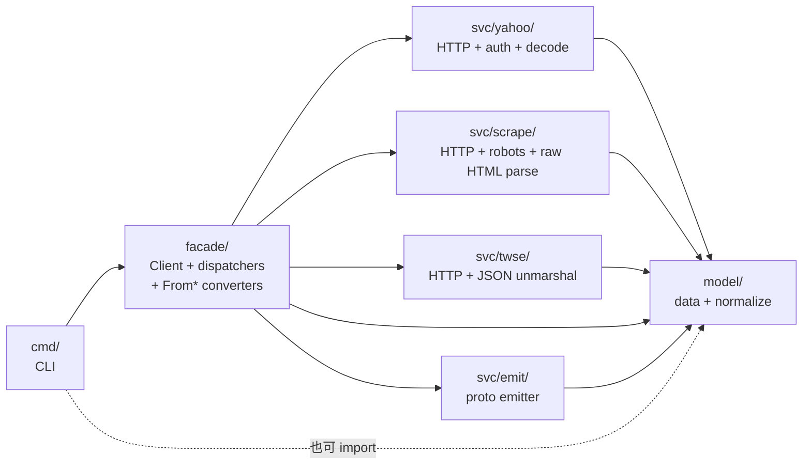

# Move Pure Data Structures to `model/` (with `svc/norm` merged in)

## Context

`yfin` 目前將「對外公開的純資料型別 + 中介 normalize 型別」分散在三個 package：

| 位置                          | 內容                                                                                                                                                |
| ----------------------------- | --------------------------------------------------------------------------------------------------------------------------------------------------- |
| `facade/*.go`                 | `Bar` / `BarBatch` / `Quote` / `MarketData` / `CompanyInfo` / `FundamentalsSnapshot` / `FundamentalsLine` / `NewsItem`                                |
| `svc/norm/*.go`               | `ScaledDecimal` + 9 個 `Normalized*` 型別 + `Normalize*` 函式 + `FromScaledDecimal` + `InferMIC` + `Meta`                                            |
| `svc/scrape/types*.go`        | `Scaled`/`YahooNum`/`KeyStatisticsDTO`/`FinancialsDTO`/`ProfileDTO`/`AnalysisDTO`/`Comprehensive*DTO`/`PeriodLine`/`NewsItem`/`NewsStats`/`FetchMeta` |
| `svc/twse/types.go`           | `Response` envelope（23 endpoint 嵌入）                                                                                                              |

問題：

1. **`cmd → facade → svc` 嚴格契約下**，cmd/ 想組裝 fixture、或 stock/data 想組裝測試資料時，被迫 import svc/* 才能拿到型別。
2. **`scrape.Scaled{Scaled, Scale}` 與 `norm.ScaledDecimal{Scaled, Scale}` 結構重複**，兩處各自呼叫的 `Float64()` / `String()` / `FromScaledDecimal()` 散在不同檔案。
3. **`norm` 在概念上是「把 raw input 變成 model 型別」** — 但目前 `model/` 不存在，norm 只能依附 `svc/norm`，型別分散。
4. **未來外部 layer（playground / 新 repo）要引用都得 import 整個 svc 子樹**，違反「model 為最底層」的乾淨分層。

目標：**建立 `model/` 作為單一最底層**，把全部「型別宣告 + 從 raw 構造 model 型別的 logic」移入；`svc/norm` 整體 merge 進 `model/`；`svc/*` 殘留為「HTTP / scrape / parsing / wire format」等副作用邏輯。

---

## 架構圖（變更後）



- `model/` 依賴：`svc/yahoo`、`svc/scrape`、`svc/twse`（為了 `Normalize*` 取 raw input）。
- `svc/yahoo`、`svc/scrape`、`svc/twse` 依賴：`model/`（型別來源）。
- **無循環**：`model` 只被依賴、不依賴 `facade` / `cmd`。
- **外部 consumer（stock、data）**：`import "github.com/bizshuk/yfin/model"` 一行拿齊資料 + normalize helpers。

---

## Phase 1 — 建立 `model/` 套件

新增 `model/` 目錄（單一 package）。每個檔案對應一個語意領域。**只放 struct + 無狀態 getter / formatter 方法**；HTTP / scrape / JSON-validate 副作用邏輯仍歸 `svc/*`。

### 1.1 `model/` 檔案配置

| 檔案                          | 內容（型別 + stateless helpers）                                                                                                                          | 來源                                       |
| ----------------------------- | --------------------------------------------------------------------------------------------------------------------------------------------------------- | ------------------------------------------ |
| `model/bars.go`               | `Bar` / `BarBatch`                                                                                                                                        | `facade/bars.go`                           |
| `model/quote.go`              | `Quote`                                                                                                                                                   | `facade/quote.go`                          |
| `model/market_data.go`        | `MarketData`                                                                                                                                              | `facade/market_data.go`                    |
| `model/company_info.go`       | `CompanyInfo`                                                                                                                                             | `facade/company_info.go`                   |
| `model/fundamentals.go`       | `FundamentalsSnapshot` / `FundamentalsLine`                                                                                                               | `facade/fundamentals.go`                   |
| `model/news.go`               | `NewsItem`（SDK facade 版，6 欄位：Title/URL/Source/Summary/PublishedAt/Symbols）                                                                        | `facade/news.go`                           |
| `model/decimal.go`            | `ScaledDecimal` + `Float64()` / `String()` / `IsZero()` + `FromScaledDecimal`                                                                            | `svc/norm/types.go` + `svc/scrape/types_json.go` 合併 |
| `model/security.go`           | `Security`                                                                                                                                                | `svc/norm/types.go`                        |
| `model/normalized.go`         | `NormalizedBar` / `NormalizedBarBatch` / `NormalizedQuote` / `NormalizedFundamentalsLine` / `NormalizedFundamentalsSnapshot` / `NormalizedCompanyInfo` / `NormalizedMarketData` / `Meta` | `svc/norm/types.go` 拆檔（內含 `time.go` / `holders.go` / `insider.go` 裡的純 struct） |
| `model/normalize.go`          | `NormalizeBars` / `NormalizeQuote` / `NormalizeFundamentals` / `NormalizeMarketData` / `NormalizeCompanyInfo` / `NormalizeHolders` / `NormalizeInsider` / `InferMIC` + `MIC` 對映表 | `svc/norm/bars.go` `quotes.go` `fundamentals.go` `market_data.go` `company_info.go` `holders.go` `insider.go` `conversion.go` |
| `model/time.go`               | `formatUTC` 等 time helpers                                                                                                                               | `svc/norm/time.go`                         |
| `model/yahoo_value.go`        | `Scaled` (= `ScaledDecimal` alias) / `Currency` (= `string`) / `YahooNum` / `YahooInt` / `YahooString` + 無狀態 accessor                              | `svc/scrape/types_json.go`                 |
| `model/yahoo_quotes.go`       | `QuoteResponse` / `QuoteResponseData` / `QuoteResult` / `Quote` + 結構的 `Get*()` accessor                                                                | `svc/yahoo/quotes.go`                      |
| `model/yahoo_bars.go`         | `ChartResponse` / `ChartMeta` / `ChartBar` / `ChartIndicators` + `GetBars()` / `GetMetadata()`                                                            | `svc/yahoo/bars.go`                        |
| `model/yahoo_fundamentals.go` | `FundamentalsResponse` / `FundamentalsData` / `FundamentalsTimeSeries` / `FundamentalsQuote` / `FundamentalsSummaryDetail` + `GetFundamentals()`         | `svc/yahoo/fundamentals.go`                |
| `model/yahoo_calendar.go`     | `CalendarResponse` / `CalendarEvent` + `GetEvents()`                                                                                                     | `svc/yahoo/calendar.go`                    |
| `model/yahoo_*.go`            | 其它 11 個 yahoo endpoint response（actions / earnings-dates / esg / holders / insider / isin / metadata / options / recommendations / secfilings / upgrades / info）+ 各自 `Get*()` | `svc/yahoo/*.go`（不含 `client.go` `auth.go`） |
| `model/scrape.go`             | `FetchMeta` / `ScrapeNewsItem`（scrape 版 NewsItem，重命名避開 facade 版）/ `NewsStats`                                                                  | `svc/scrape/types.go`                      |
| `model/scrape_dtos.go`        | `PeriodLine` / `Recommendation` / `QuarterlyEPS` / `Officer` / `KeyStatisticsDTO` / `FinancialsDTO` / `ProfileDTO` / `AnalysisDTO` / `ComprehensiveFinancialsDTO` / `ComprehensiveKeyStatisticsDTO` / `ComprehensiveProfileDTO` / `ComprehensiveAnalysisDTO` / `AnalystInsightsDTO` | `svc/scrape/types_json.go`                 |
| `model/twse_response.go`      | `Response` envelope + `GetStat()` + 23 個 endpoint response struct（`MIIndexResp` / `StockDayResp` / ...，`*Resp` 避免與同名 cmd 型別衝）                                                                                  | `svc/twse/types.go` + 23 endpoint 檔的純 struct 部分 |

### 1.2 型別命名衝突與決議

| 衝突                                              | 決議                                                                                  |
| ------------------------------------------------- | ------------------------------------------------------------------------------------- |
| `facade.NewsItem` 與 `scrape.NewsItem` 欄位不同 | `model.NewsItem` = facade 版（公開）；`model.ScrapeNewsItem` = scrape 版              |
| `scrape.Scaled` 與 `norm.ScaledDecimal` 結構同    | `model.ScaledDecimal` 為主；`model.Scaled = ScaledDecimal`（alias）保 scrape 程式碼可寫 |
| 23 個 TWSE endpoint struct 與 cmd/* 取的局部型別同 | `MIIndexResp` / `StockDayResp` / ... 顯式加 `Resp` suffix 避免外部衝                  |

### 1.3 「方法」搬遷界線

**搬到 model/（無狀態）：**
- `ScaledDecimal.Float64() / String() / IsZero() / FromScaledDecimal(...)`
- `Response.GetStat()`
- 所有 yahoo response 的 `Get*()` accessor（從 `svc/yahoo/*.go` 移入）
- `Meta` / `Security` 的 accessor（如有）

**留 svc/*（行為、副作用）：**
- `ScaledDecimal.FromScaledDecimal(sd) *ScaledDecimal`（嚴格說是 constructor，但是 stateless）→ **搬到 model/，因為它是無狀態轉換**
- `RobotsCache.IsExpired()` ← 有狀態
- `QuoteResponse.Validate()` ← 業務驗證（bid ≤ ask 等）
- `DecodeXxx(...)` / `DecodeXxxFromReader(...)` ← JSON decode（副作用）
- `scrape.Config` / `RetryConfig` / `EndpointConfig` / `RobotsPolicy` / `DefaultConfig()` ← 配置
- `scrape.ParseYahooDate` / `CoerceCurrency` / `StringToInt64` ← 帶規則的轉換
- 23 個 TWSE endpoint 檔的 `FetchXxx(ctx, *Client, ...)` 函式 ← HTTP + unmarshal
- `svc/emit.MapXxx(...)` ← proto 輸出（transport 邏輯）

---

## Phase 2 — `svc/norm` 整體 merge 進 `model/`

`svc/norm` 下的 `normalize.go` / `decimal.go` / `conversion.go` 等所有檔案內容整體搬入 `model/` 對應檔案，並刪除 `svc/norm/`。搬遷規則：

1. **方法 receiver 自動跟著型別走**：原本 `func (b *NormalizedBarBatch) X()` 在 `svc/norm` 內，搬到 `model` 後型別是 `model.NormalizedBarBatch`，receiver 改成 `*model.NormalizedBarBatch`。
2. **import path 改寫**：`svc/norm` 內檔案互相 import 變成 model 內檔案（不需 import），原 `svc/norm` 內部 helper 直接寫在同一 package。
3. **依賴新增**：model 的 `NormalizeBars` 函式簽名原本是 `NormalizeBars(bars *yahoo.ChartBars, meta *yahoo.ChartMeta, runID string)`，搬到 model 後變成 `NormalizeBars(bars *model.ChartBars, meta *model.ChartMeta, runID string)`。因為 yahoo 型別也搬到 model，**無循環**。
4. **測試搬遷**：`svc/norm/bars_test.go` 等 5 個測試檔整體搬入 `model/` 對應檔案（`model/bars_test.go` 等），或保留測試位置但改成測 model 套件。

---

## Phase 3 — 設型別別名（向後相容）

每個搬走的型別在原 package 內設 type alias，讓既有呼叫點**繼續編譯**。

### 3.1 `facade/*.go` 加 alias

```go
type Bar = model.Bar
type BarBatch = model.BarBatch
type Quote = model.Quote
type MarketData = model.MarketData
type CompanyInfo = model.CompanyInfo
type FundamentalsSnapshot = model.FundamentalsSnapshot
type FundamentalsLine = model.FundamentalsLine
type NewsItem = model.NewsItem
```

`facade/From*` / `facade/fromProto*` 轉換器保留，內部用 `model.X`。

### 3.2 `svc/scrape/*.go` 加 alias

```go
type FetchMeta = model.FetchMeta
type NewsItem = model.ScrapeNewsItem
type NewsStats = model.NewsStats
type Scaled = model.ScaledDecimal
type KeyStatisticsDTO = model.KeyStatisticsDTO
type FinancialsDTO = model.FinancialsDTO
// ... 全 16 個 DTO 加 alias
```

`svc/scrape` 的方法（`ParseComprehensiveFinancials` 等）receiver 自動解析。

### 3.3 `svc/yahoo/*.go` 重大縮減

每個 response 檔案留下 `decode` / `validate` / HTTP-fetch 行為，將結構宣告與 accessor method 移走：

```go
// svc/yahoo/quotes.go（縮減後）
package yahoo
import "github.com/bizshuk/yfin/model"

func DecodeQuoteResponse(data []byte) (*model.QuoteResponse, error) { /* ... */ }
func (r *model.QuoteResponse) Validate() error                       { /* ... */ }
// GetQuotes 在 model/yahoo_quotes.go
```

### 3.4 `svc/twse/types.go` 與 23 endpoint 檔

```go
// svc/twse/types.go（alias only）
type Response = model.Response
type MIIndexResp = model.MIIndexResp
// ... 23 個別名
type Fetcher = /* 原本就有的 func type，留在 svc/twse（行為）*/
type Endpoint struct { ... }  // 留在 svc/twse（dispatcher meta）
var Registry = map[string]Endpoint{ ... }
```

每個 endpoint 檔（`mi_index.go` 等）的 `FetchXxx` 函式內部用 `model.X`，回傳 signature 保留 `(any, error)` 或顯式 `(*model.MIIndexResp, error)`。

### 3.5 `svc/emit/*.go`

`emit.MapQuoteToProto(...)` 等接收 `*model.NormalizedQuote`（不再 `norm.NormalizedQuote`）。輸入型別變更需逐函式改 import path。

---

## Phase 4 — 刪除 `svc/norm/`

合併完成後：
```bash
rm -rf svc/norm/
```

驗證無引用：`grep -rn "bizshuk/yfin/svc/norm" .` 應為空。

---

## Phase 5 — 更新 consumer（移除 facade.X / svc.X 對型別的依賴）

| 檔案                                            | 動作                                                                                                                                |
| ----------------------------------------------- | ----------------------------------------------------------------------------------------------------------------------------------- |
| `cmd/client.go`                                 | `facade.BarBatch` → `model.BarBatch`                                                                                                |
| `cmd/dispatch/dispatch.go`                      | 同上                                                                                                                                |
| `cmd/fundamentals/fundamentals_run.go`          | `norm.Normalized*` → `model.Normalized*`                                                                                            |
| `cmd/fundamentals/profile.go`                   | 同上                                                                                                                                |
| `cmd/fundamentals/stats.go`                     | 同上                                                                                                                                |
| `cmd/market/pull.go`                            | 同上                                                                                                                                |
| `cmd/market/quote.go`                           | 同上                                                                                                                                |
| `cmd/scrape/scrape_run.go`                      | `scrape.ComprehensiveFinancialsDTO` → `model.ComprehensiveFinancialsDTO`                                                            |
| `cmd/soak/orchestrator.go` / `probes.go` / `worker.go` | 同上                                                                                                                                |
| `cmd/twse/twse.go` / `twse_test.go`             | `twse.Endpoint` 保持 alias（facade 已暴露）；`scrape.NewClient` 等 import 視情況                                                    |
| `facade/samples/**/*.go`（6 個 sample）         | `facade.Bar` → `model.Bar`（samples 是對外示範程式）                                                                                |
| `tests/data_correctness_test.go`                | `svc/norm.*` 引用清掉                                                                                                              |

---

## Phase 6 — 文件同步

- `CLAUDE.md`：`Project Structure` 表格新增 `model/` 列為「資料型別 + normalize 最底層」；更新依賴方向為 `cmd → facade → svc → model`；標註 `svc/norm` 移除。
- `docs/data-structures.md`：新增 `model/` 章節，列每個檔案與用途。
- `docs/api-reference.md`：把 `facade.Bar` 等改為 `model.Bar`，標註 `facade.Bar` 為 alias 仍可用。

---

## 關鍵檔案（變更集總覽）

**新增 ~22 檔**（model/）：
`bars.go` `quote.go` `market_data.go` `company_info.go` `fundamentals.go` `news.go` `decimal.go` `security.go` `normalized.go` `normalize.go` `time.go` `yahoo_value.go` `yahoo_quotes.go` `yahoo_bars.go` `yahoo_fundamentals.go` `yahoo_calendar.go` 其它 11 個 yahoo endpoint response 檔、`scrape.go` `scrape_dtos.go` `twse_response.go`。

**新增 ~10 個測試檔**（搬自 svc/norm）：`bars_test.go` `fundamentals_test.go` `company_info_test.go` `market_data_test.go` `conversion_test.go` `decimal_test.go` `quotes_test.go`。

**修改**：
- `facade/{bars,quote,market_data,company_info,fundamentals,news}.go`：加 8 個別名
- `svc/scrape/types.go` / `types_json.go`：縮減成 alias
- `svc/yahoo/*_response*.go`：縮減（每檔只留 decode/validate/HTTP）
- `svc/twse/{types.go, 23 endpoint 檔}`：加 alias 或改 import
- `svc/emit/*.go`：改輸入型別 import path
- `cmd/**/*.go`（~13 檔）：改 import path
- `facade/samples/**/*.go`（6 檔）：改 import path
- `tests/data_correctness_test.go`：改 import path

**刪除**：
- `svc/norm/`（整個目錄，~10 檔源碼 + ~5 檔測試）

**文件**：
- `CLAUDE.md` / `docs/data-structures.md` / `docs/api-reference.md`

---

## 規模估算

| 項目           | 變更前            | 變更後                                                       |
| -------------- | ----------------- | ------------------------------------------------------------ |
| `model/` LOC   | 0                 | ~2500–3000（純資料 + normalize；測試另計）                  |
| `svc/norm/`    | ~1200 LOC         | 刪除                                                          |
| `svc/*` 總 LOC | ~8000             | 縮減到 ~6800（移除 normalize 邏輯與 data struct 重複宣告）   |
| `model/` 檔數   | 0                 | ~30 source + ~10 test files                                  |

整體不會膨脹，但 `model/` 成為 hub。

---

## 風險與緩解

| 風險                                            | 緩解                                                                                          |
| ----------------------------------------------- | --------------------------------------------------------------------------------------------- |
| **import cycle**：model → svc/yahoo → model      | model 與 svc/yahoo 兩者**互相 import 但允許**：model 的 normalize 需要 yahoo 型別；yahoo decode 需要 model 型別當 return。Go 允許互引型別，不允許 cycle 在**初始化**層。若無 package-level init 依賴即可。驗證：`go build ./...` 必須通過；本計畫刻意不在 model/* 加 init()。 |
| **model 變胖**違反單一職責                       | 接受 trade-off：model = 「data + to-data converters」是使用者要求的合併目的。子目錄拆分（`model/raw/`、`model/scrape/`、`model/yahoo/`）可在 user 要求時再展開。 |
| **scrape.Scaled = model.ScaledDecimal** 兩名同物 | scrape 內仍可寫 `scrape.Scaled{}`，經 alias 等同 `model.ScaledDecimal{}`，無 breaking change。    |
| **測試 fixture 路徑變更**                       | `svc/norm/*_test.go` 搬到 `model/` 後仍可測；驗證：`go test ./model/...` 全綠。                  |
| **外部 consumer (stock, data) 還在用 facade.X** | facade alias 路徑保留 → 不需外部改。                                                            |

---

## 驗證

1. **無 import cycle**：`go build ./...` 必須 zero error。
2. **靜態檢查**：`go vet ./...` 零 warning。
3. **既有測試**：`go test ./...` 全綠，包含：
   - `model/` 內部測試（搬自 svc/norm + svc/norm 原 5 個測試檔）
   - `facade/fundamentals_test.go` / `facade/market_data_test.go`（驗證 alias 互通）
   - `svc/emit/roundtrip_test.go` / `validation_test.go` / `golden_test.go`
   - `cmd/twse/twse_test.go`
   - `tests/data_correctness_test.go`
4. **CLI smoke test**：
   ```bash
   go build -o /tmp/yfin ./cmd/yfin
   /tmp/yfin --help
   /tmp/yfin pull AAPL --adjusted 2>&1 | head -20
   /tmp/yfin quote AAPL 2>&1 | head -10
   /tmp/yfin scrape AAPL --preview-json --endpoint profile 2>&1 | head -30
   /tmp/yfin twse --endpoint MI_INDEX --date 2024-01-15 2>&1 | head -20
   ```
   五個 smoke 行為與重構前一致。
5. **alias 路徑可用性測試**：手動在某 cmd 檔暫時改回 `facade.Bar`（用 alias 解析為 `model.Bar`）→ 仍可編譯。再改回 `model.Bar`。
6. **刪除 svc/norm 完整性**：`grep -rn "bizshuk/yfin/svc/norm" .` 應為空。
7. **外部 consumer smoke（若可用）**：`cd ~/projects/stock && grep -rn "yfin/facade\.\(Bar\|Quote\|...\)\b"` 列出仍走 facade alias 的引用點。

完成後 repository 結構：

```
yfin/
├── cmd/        # CLI（import model + facade + svc/emit）
├── facade/     # Client + dispatchers + converters（import model + svc/*）
├── svc/
│   ├── yahoo/  # HTTP + auth + decode（import model）
│   ├── scrape/ # HTTP + robots + HTML parse（import model）
│   ├── emit/   # proto emitter（import model）
│   └── twse/   # HTTP + JSON unmarshal（import model）
├── model/      # 純資料 + normalize logic（import svc/yahoo + svc/scrape + svc/twse）
├── config/
├── utils/
└── tests/
```